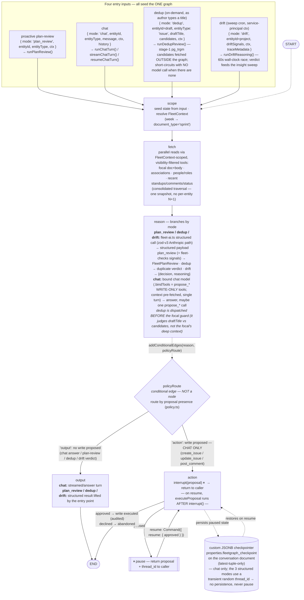

# Fleet/FleetGraph AGENT

## Agent Responsibility
What does this agent monitor proactively?
    - Proactively, we're watching a Project's 'plan' field. Ship's philosophy states that a plan is a hypothesis about what value it will deliver. Because of the overall value that this hypothesis can add to a retro, the agent judges the quality of the plan and provides tips to improve it. The proactive output now has two paths: (1) the cached plan-review on the Project Details card (request-triggered, on page load), and (2) a **scheduled, no-user-present drift sweep** — a `node-cron` tick that runs every 4 minutes (`api/src/scheduler/index.ts`, env-gated by `FLEETGRAPH_SWEEP_ENABLED` + a per-workspace `settings->fleetgraph->>'sweep_enabled'` toggle) that detects project drift, runs an LLM verdict on it, and persists findings as `insight` documents. So sweeps are no longer deferred — what remains deferred is the *event-driven* (change-triggered) path and any *external* notification.

What does it reason about when invoked on demand?
    - The current page's focal entity (a Project or Week) and the context the graph fetches for it: the plan, its associated issues and their statuses, the people/roles on the workspace, and recent activity (standups, comments, status changes). It answers the user's question grounded only in that scoped context, and can diagnose *why* a project looks stuck and recommend a next action.

What can it do autonomously?
    - Read-only reasoning over user entities, plus one narrow autonomous write: the agent gathers the project/week context (visibility-filtered to what the requesting user can see), runs the proactive plan-review, answers questions, and *drafts* proposed changes. It never mutates a user entity (issue/project/week/comment) on its own — every such mutation is surfaced as a proposal for confirmation first. The one thing it now does autonomously is the drift sweep persisting **system-authored `insight` documents** (`created_by = NULL`, a separate findings store — not an edit to any user entity), exactly the path anticipated below. The no-write-without-confirmation rule still governs all entity mutations.

What must it always ask a human about before acting?
    - Any state-changing write: creating an issue, patching an issue (status / owner / priority / assignment / edit), or posting a comment. The agent surfaces the fully-resolved change as a confirmable card; nothing is written until the user explicitly confirms in chat, and the write then runs under the user's own permissions and is audited.

Who does it notify, and under what conditions?
    - In-app only — there are no external notifications. The request-triggered surfaces (plan-review on page load, chat) render inline to the requesting user. The scheduled drift sweep does not push anything externally; it persists `insight` documents that surface passively in-app via the Insights page (`web/src/pages/Insights.tsx`) and an icon-rail count badge (visibility-scoped to what each user can see). **External notifications (email/Slack/push) remain deferred** — the sweep nudges via the in-app count badge, not a message out.

How does it know who is on a project and what their role is?
    - Through the fetch layer's people/roles read: it reads the workspace's `person` documents joined to `workspace_memberships`, taking the role from `workspace_memberships.role`. The read is scoped by the requesting user's FleetContext/visibility, so the agent never sees people or data the user couldn't.

How does the on-demand mode use context from the current view?
    - The in-page launcher seeds the chat session with the current page's entity (`{ entityId, entityType }`, where a Week maps to a sprint document), so the user doesn't have to restate it. The graph's scope → fetch nodes resolve that entity and pre-load its full context (focal doc + plan, associated issues, people, recent activity) into the prompt, and the answer is grounded in exactly that scope.

Does it poll on a schedule? How frequently?
    - Yes — shipped. A `node-cron` tick that runs every 4 minutes (`SWEEP_CRON_SCHEDULE = '*/4 * * * *'`,
      `api/src/scheduler/index.ts`, registered from `api/src/index.ts` after `server.listen`) runs as a
      scheduled backstop, not the primary path. A periodic sweep is required because the
      highest-value proactive signals are *time-based* and have no triggering event — e.g. "no movement
      in N days," "target_date approaching/passed," or a project that was never analyzed. The hash-cache
      (`input_hash` over day-rounded drift inputs) means most swept projects are no-op refreshes, so the
      sweep is cheap; pure high-frequency polling is rejected as wasteful (it diffs every project every
      tick just to catch the few that changed). The tick is env-gated (`FLEETGRAPH_SWEEP_ENABLED`, an
      ops kill switch, default off) and per-workspace gated (`settings->fleetgraph->>'sweep_enabled'`),
      and takes a non-blocking per-workspace advisory lock so multiple app instances are single-flight.

Is it triggered by Ship events via webhook?
    - Not yet — this is the deferred half of the trigger model. "Webhook" overstates it anyway: Ship is
      the system of record, so there's no external source to receive webhooks from. The intended design
      is to emit INTERNAL domain events when a relevant field changes (plan edited, issue status/owner
      changed, standup/comment posted) from the existing mutation service paths (issues-service,
      comments-service, document-crud) — via an outbox table or pg LISTEN/NOTIFY — and enqueue a scoped
      re-analysis for the affected project. That would give the brief's <5-min detection latency without
      polling, and naturally debounce by coalescing bursts per project. **None of this event-driven
      plumbing has shipped** — today the only proactive path is the scheduled sweep above.

Is it a hybrid of both?
    - Yes — that's the target, and the scheduled half has shipped. Events handle change-driven freshness
      cheaply and with low latency; the scheduled sweep covers time/decay conditions that no event
      represents and acts as a reconciliation safety net if an event is missed. The pieces that were
      called "deferred" in the original plan have largely landed: the **service-level FleetContext**
      (no user present — `SYSTEM_USER_ID` + `isAdmin`, bounded to workspace scope) and **proactive
      findings persisted as `insight` documents** (rather than written back to entities, so the
      no-write-without-confirmation rule still holds). Notably it shipped *without* the heavier
      infrastructure the plan anticipated: instead of a separate EB worker tier + job queue, the sweep
      runs as a simple **in-process `node-cron` task** on the existing API tier (env-gated as a kill
      switch). The remaining deferred piece is the **event-driven half** (low-latency, change-triggered
      re-analysis).

## Graph Diagram


## ASCII (quick reference)

```
            ┌─ plan_review: { mode:'plan_review', entityId }            (runPlanReview)
            ├─ chat:        { mode:'chat', entityId, message, history }  (runChatTurn / streamChatTurn / resumeChatTurn)
 trigger ───┤
            ├─ dedup:       { mode:'dedup', draftTitle, candidates }     (runDedupReview — stage-1 pg_trgm OUTSIDE graph)
            └─ drift:       { mode:'drift', entityId, driftSignals }     (runDriftReasoning — sweep cron, 60s race)
                  │
                  ▼
            scope        seed state · resolve FleetContext (week→sprint)
                  │
                  ▼
            fetch        parallel visibility-scoped reads → one merged context snapshot
                  │
                  ▼
            reason       plan_review / dedup / drift → fleet-ai structured (zod-v3 Anthropic path)
                  │      chat                        → bound chat model (propose_* WRITE-ONLY; context pre-fetched)
                  │      (dedup dispatched before the focal guard)
                  ▼
            policyRoute ──────────┐   ← conditional edge (policy.ts), not a node
              │ (no write)        │ (write proposed — CHAT ONLY)
              ▼                   ▼
            output            action ── interrupt(proposal) ──► [pause → caller]
              │                   ▲                                  │ resume Command({approved})
              ▼                   └──────── re-run from top ─────────┘
             END                 mutation executes AFTER interrupt(); pre-interrupt work idempotent
                                 approved → executeProposal (audited) ; declined → abandon → END
```


## Use Cases
Each entry gives role, trigger, what the agent detects or produces, and what the human decides.
The status in parentheses reflects what has actually shipped — this is a living document, so
update it as each case lands.

1) Project Plan Review (✅ Shipped — proactive plan-quality review + suggested rewrite)
    - **Role**
        - PM / Director (plan author)
    - **Trigger**
        - Request-triggered: the cached plan review renders on the project's Fleet review surface when the page loads; after the user edits the plan, reopening (or hitting refresh) recomputes a fresh evaluation. Backed by the graph's `plan_review` mode (`runPlanReview` → `getReview`).
    - **Agent Detects / Produces**
        - Judges the plan as a testable hypothesis against a fixed rubric — `what_changes`, `by_how_much`, `for_whom`, plus `by_when` (a Target Date check) — returning a per-piece met/unmet checklist, an overall status (`looks_testable` / `needs_work` / `no_plan`), a one-sentence diagnosis + recommended next action, and a **suggested rewrite** of the plan. Degrades to "unavailable" when the model is down or there is no plan.
    - **Human Decides**
        - Adopt the suggested rewrite, tighten the plan to satisfy the unmet pieces, or set a Target Date — advisory only; the agent never edits the plan itself.
2) Project Drift Detection (✅ Shipped — detection + scheduled sweep + LLM verdict + insight surfacing + on-demand explanation)
    - **Role**
        - PM / Director
    - **Trigger**
        - Two paths: (a) on-read `DriftBadge` when a project list/detail is viewed; (b) every-4-minutes `node-cron` sweep (env + per-workspace gated), no user present
    - **Agent Detects / Produces**
        - Detects stale plan / no movement / rising incomplete work via `computeProjectDrift` over `driftSql.ts`. Sweep path runs an LLM verdict (`drift` mode, `runDriftReasoning` → SURFACE_ACT / SURFACE_FYI / SUPPRESS + reasoning) that gates surfacing, then persists an `insight` (severity, summary, evidence, verdict); deterministic fallback when the model is unavailable; one open insight per (workspace, subject, kind); stable detection = hash-cache no-op. (Standup/week-doc signals deferred — person-scoped.)
    - **Human Decides**
        - Ask for root cause via drift badge → seeded chat (`DriftBadge`/`buildDriftPrompt` → `FleetChatContext` seedPrompt); **resolve** a surfaced insight (`POST /api/insights/:id/resolve`). Snooze / dismiss / create-follow-up reserved in the lifecycle model but deferred.
3) Contextual "What Should I Do Next?" (✅ Shipped — issue entity type + seeded chat)
    - **Role**
        - Any user
    - **Trigger**
        - On-demand chat from an issue/project/week page. Issues show a "What should I do next?" button (seeded prompt); projects and weeks show "Ask Fleet"
    - **Agent Detects / Produces**
        - Next action, blockers/risks, missing context, suggested state/priority/assignee updates — grounded in the issue's state/priority/assignee, parent project, sibling issues, and recent comments/status changes. Entity types: `project`, `week`, `issue` (programs deferred)
    - **Human Decides**
        - Apply suggested edit, open linked docs, post comment, create issue — all via the `propose_*` / confirm HITL flow
4) Retro Assistant (✅ Shipped — retro-page analysis; advisory)
    - **Role**
        - PM / Engineer
    - **Trigger**
        - Retro page load. (An end-of-week *proactive* retro sweep is deferred — the scheduler exists but only runs the drift sweep)
    - **Agent Detects / Produces**
        - Weekly retro → completeness score + per-plan-item coverage/evidence feedback. Project retro → a `validated` / `invalidated` / `insufficient_evidence` recommendation with `evidence_found`, `evidence_missing`, and a suggested conclusion
    - **Human Decides**
        - Advisory only — accept or revise; the human still sets `plan_validated` (the agent never auto-applies it)
5) Issue Dedup-on-Create (✅ Shipped — two-stage: pg_trgm typeahead + graph-backed verdict)
    - **Role**
        - Any user
    - **Trigger**
        - On-demand, inline, as an issue's title is typed; Stage 2 sits behind an "Ask Fleet if these are duplicates" button
    - **Agent Detects / Produces**
        - **Stage 1** (cheap, per-keystroke, no model): `pg_trgm` over `documents.title` (GIN index mig 038, 0.3 threshold), workspace open issues the user can see, debounced ~350ms → ≤5 candidates. **Stage 2** (`dedup` mode, graph-backed): model judges true duplicates vs merely similar → per-match confidence + reason + recommendation; degrades to candidates-only if the provider is unavailable; no model call when zero candidates. Why a graph case: the judgement is reasoning `pg_trgm` cannot do
    - **Human Decides**
        - Open an existing issue instead of filing a duplicate, run the Fleet check, or dismiss. Read-only verdict; a `propose_link` / `propose_merge` action via the HITL flow is a future extension


## Trigger Model
**Hybrid** - Using cron job for a scheduled sweep every 4 minutes, detecting Project Drifts and creating Insight notifications without any user interaction. On-demand trigger by user for Project Plan Reviews, Issue Deduplification, Project Retro Assistance, and Issue Deduplication.


## Test Cases

| # | Use case | Ship State | Expected Output | Trace Link |
|---|----------|-----------|----------------|------------|
| 1 | Project Plan Review | A project with a `plan` field populated (and optionally a Target Date), viewed on its Fleet review surface — or a plan edited, then reopened/refreshed to recompute. | `plan_review` mode (`runPlanReview` → `getReview`) judges the plan as a testable hypothesis against the rubric (`what_changes` / `by_how_much` / `for_whom` / `by_when`), returning a per-piece met/unmet checklist, an overall status (`looks_testable` / `needs_work` / `no_plan`), a one-sentence diagnosis + recommended next action, and a suggested rewrite; degrades to "unavailable" when the model is down or there is no plan. Advisory only — the agent never edits the plan. | [LangSmith](https://smith.langchain.com/public/e4087b06-44ed-4177-be51-bac82871e86a/r) |
| 2 | Project Drift Detection | A project whose plan was last edited >N days ago, with open issues and no recent activity, in a workspace with `sweep_enabled=true` (and `FLEETGRAPH_SWEEP_ENABLED=true`). | The every-4-minutes sweep detects drift (`computeProjectDrift`), `drift` mode returns `SURFACE_ACT`/`SURFACE_FYI` with reasoning, and an `insight` document is created (severity, summary, evidence) surfaced on the Insights page + count badge. A re-run with unchanged state is a hash-cache no-op refresh. | [LangSmith](https://smith.langchain.com/public/73c69c64-78ff-4319-89f3-44b78acf6283/r) |
| 3 | "What should I do next?" | An issue with a state/priority/assignee, a parent project, sibling issues, and recent comments; user clicks "What should I do next?" (seeded chat). | A grounded next action plus blockers/risks, missing context, and suggested state/priority/assignee updates — all offered through the `propose_*` / confirm HITL flow, nothing auto-applied. | [LangSmith](https://smith.langchain.com/public/55e12a75-2c93-4efa-a720-ef1670545d0c/r) |
| 4 | Retro Assistant | A weekly retro page (plan items + evidence) or a project retro page loaded. | Weekly: a completeness score + per-plan-item coverage/evidence feedback (`analyzeRetro`). Project: a `validated` / `invalidated` / `insufficient_evidence` recommendation with evidence found/missing and a suggested conclusion (`buildRetroRecommendation`). Advisory only — the human still sets `plan_validated`. | [LangSmith](https://smith.langchain.com/public/79e4b475-1d03-4da8-b044-cb52132ee001/r) |
| 5 | Issue Dedup-on-Create | In a workspace with existing open issues, the author types an issue title similar to an existing one, then clicks "Ask Fleet if these are duplicates". | Stage 1: `pg_trgm` candidates listed under the title (≤5). Stage 2 (`dedup` mode): per-match true-duplicate verdict with confidence + reason and a recommendation; degrades to candidates-only if the provider is unavailable; no model call when there are zero candidates. | [LangSmith](https://smith.langchain.com/public/ca43d6af-81f8-43bd-885c-2907a50d70bc/rw) |

# Architecture Decisions
**Framework choice — one compiled LangGraph `StateGraph`, four modes.** A single graph serves all four entry inputs (`plan_review`, `chat`, `dedup`, `drift`); the trigger differs, the graph does not. Chosen over four bespoke pipelines so context-fetching, visibility scoping, checkpointing, and the HITL path are written and tested once. LangGraph specifically (over a hand-rolled state machine) for its built-in interrupt/resume — which is what makes the confirm-before-write flow durable across a process restart.

**Node design — `scope → fetch → reason → policyRoute → action | output`.** `scope` seeds state and resolves the `FleetContext`; `fetch` does one consolidated, visibility-filtered, parallel read (no per-entity N+1); `reason` branches by mode (structured `evaluateStructured` call for `plan_review`/`dedup`/`drift`, bound chat model for `chat`). `policyRoute` is a pure conditional **edge**, not a node (the former no-op `policy` node was removed) — it routes to `action` only when a write proposal exists, so only `chat` ever reaches the interrupt. Keeping routing in a pure function makes the low-risk-vs-write classification unit-testable without driving the whole graph.

**State management — `Annotation` channels with per-channel reducers.** Graph state is plain `Annotation` (not zod): the fetched snapshot is REPLACE (each fetch is a complete picture), `messages` is APPEND (the chat turn accumulates), scalar scope channels are REPLACE. **zod is reserved for tool/output schemas, not graph state** — this keeps the load-bearing zod-v3/v4 Anthropic structured-output workaround confined to the model boundary.

**Two-tier provider strategy.** Structured modes call `fleet-ai.ts`'s `evaluateStructured` (preserving the tested zod Anthropic workaround verbatim); chat uses LangChain `getBoundChatModel` with **write-only** `.bindTools` (`propose_*`). The `fetch` node pre-loads the full read context into the prompt, so chat answers in a single turn with no read-tool round-trips — binding read tools would leak unrun `tool_use` blocks into the answer.

**Deployment model.** The proactive sweep runs as an **in-process `node-cron` task on the existing API or Elastic Beanstalk tier** — not a separate worker tier or job queue — env-gated (`FLEETGRAPH_SWEEP_ENABLED`) and per-workspace toggled, with a per-workspace advisory lock for single-flight across instances. Paused chat proposals persist via a custom JSONB checkpointer (`ConversationDocCheckpointSaver`) that writes to `properties.fleetgraph_checkpoint` on the conversation document (latest-tuple-only), so a confirm/resume survives a restart without a dedicated checkpoint store. Findings persist as system-authored `insight` documents in the existing `documents` table — no new content table, consistent with Ship's unified-document model.


I'll convert this cost analysis into markdown for you.

# Cost Analysis (**Pending**)

## Development and Testing Costs

- Cost per graph run Documented and defended in FLEETGRAPH.md
- Estimated runs per day Documented and defended in FLEETGRAPH.md

| Item | Amount |
|------|--------|
| Claude API - input tokens | |
| Claude API - output tokens | |
| Total invocations during development | |
| Total development spend | |

## Production Cost Projections

| 100 Users | 1,000 Users | 10,000 Users |
|-----------|-------------|--------------|
| $\_\_\_/month | $\_\_\_/month | $\_\_\_/month |

**Assumptions:**
- Proactive runs per project per day:
- On-demand invocations per user per day:
- Average tokens per invocation:
- Cost per run:
- Estimated runs per day:
