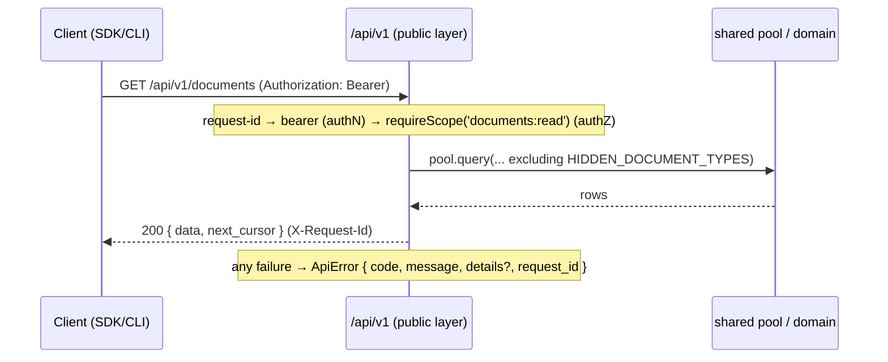
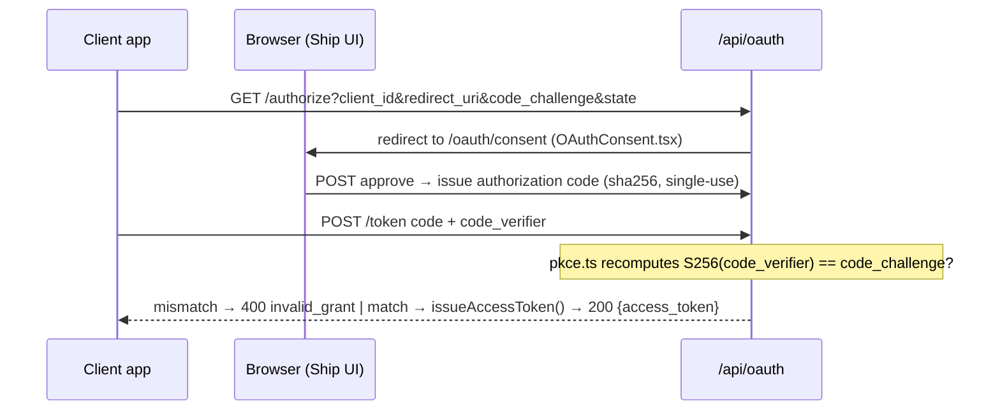
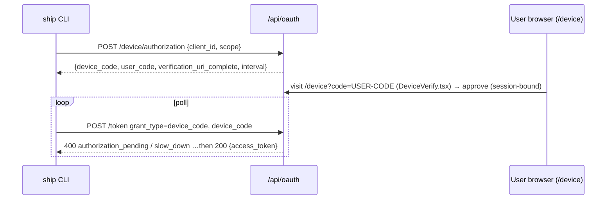
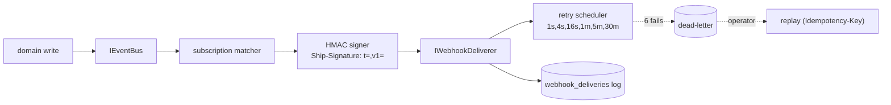

# Ship Platform — Architecture

> **Status.** This document reflects the system **as built**: the Plugforge MVP
> gate (public `/api/v1`, OAuth 2.0 Authorization Code + PKCE, scopes, `ApiError`, generated
> OpenAPI 3.1, `@ryanjagger/ship-sdk`), plus the RFC 8628 Device Authorization Grant and the
> `ship` CLI. Sections marked **Planned** track the full PRD roadmap (webhooks, agent-as-citizen,
> refresh rotation) and are **not yet implemented** — they are documented so the contract and the
> module seams are visible before the code lands.

The public platform is a hermetic layer under `api/src/platform/`. It shares the database and
domain logic with Ship's internal `/api/` app but attaches its own authentication, scope
authorization, request correlation, and error shape — and is forbidden by lint from importing
internal route handlers.

---

## Module Layout

```
api/src/platform/
├── oauth/                         OAuth 2.0 authorization server (RFC 6749 + 7636 + 8628)
│   ├── apps.ts                    oauth_apps model: client_id/secret, createOAuthApp, find*
│   ├── admin-routes.ts            POST /api/admin/oauth-apps — admin registration (secret shown once)
│   ├── routes.ts                  /authorize, /token, /device/* endpoints (grant dispatch)
│   ├── authorize-request.ts       authorize-request validation (redirect_uri, scope subset)
│   ├── pkce.ts                    PKCE S256 challenge recomputation (RFC 7636)
│   ├── codes.ts                   authorization codes: sha256-hashed, short TTL, single-use
│   ├── device-codes.ts            device codes (RFC 8628): issue / poll / approve / deny
│   ├── tokens.ts                  issueAccessToken / validateAccessToken (SHA-256, 1h TTL)
│   └── oauth-errors.ts            RFC 6749 §5.2 + 8628 token-endpoint error shapes
└── api/v1/                        Public REST API (versioned, contract-first)
    ├── router.ts                  v1 entry: request-id → routes → 404/error handlers
    ├── middleware/bearer.ts       authN: validates the bearer token, attaches req.platform
    ├── middleware/require-scope.ts authZ: requireScope(scope) + authOnly() factories
    ├── scopes/registry.ts         ScopeRegistry — scopes-as-data
    ├── routes/{me,documents}.ts   resource handlers (call the shared DB directly)
    ├── schemas/{error,document,me}.ts  Zod request/response schemas (also feed OpenAPI)
    ├── openapi/{spec,export}.ts   OpenAPI 3.1 generated from the schemas above
    ├── errors.ts                  ApiError contract + sendApiError
    ├── error-middleware.ts        404 + global handler — guarantees ApiError on every failure
    ├── request-id.ts              UUID per request → req.platformRequestId + X-Request-Id
    ├── rate-limit.ts              reshapes the global limiter's 429 into ApiError (v1 only)
    └── cursor.ts                  opaque keyset cursor encode/decode ({id, created_at})

sdk/src/index.ts                   @ryanjagger/ship-sdk (v0.1.0-rc.0) — zero-dep, injectable fetch
sdk/src/cli/                       `ship` binary packaged by @ryanjagger/ship-sdk
```

Notes: **rate-limiting** today is `api/v1/rate-limit.ts` (a reshape of the existing global
limiter — see Composition Root), not a per-token bucket. **Audit** lives internally at
`api/src/services/audit.ts` and is **not yet** wired into `/api/v1` (Planned). **Webhooks** has
no module yet — only the `webhooks:manage` scope is registered (Planned).

---

## SOLID Rationale

- **OCP — `scopes/registry.ts`.** Scopes are data, not branches. A new scope is registered at
  module load; `middleware/require-scope.ts` reads the registry and never changes to add one.
  The OpenAPI generator is open the same way: `openapi/spec.ts` `buildRegistry()` registers each
  route's Zod schemas, so adding a route extends the spec without editing the generator.
- **SRP — the v1 middleware chain.** Each middleware owns exactly one concern: `bearer.ts`
  (authentication), `require-scope.ts` (authorization), `request-id.ts` (correlation),
  `rate-limit.ts` (429 shaping), `error-middleware.ts` (error shape). Routes compose them; none
  of them knows about the others.
- **ISP — resource-segregated SDK clients.** `ShipClient` exposes `.documents` and `.issues`
  (`sdk/src/index.ts`) as separate interfaces, so a consumer that only reads documents depends on
  the documents surface alone. New resources (`webhooks`, `sprints`) slot in without widening the
  existing clients.
- **DIP — injected `fetch`.** The SDK depends on the `fetch` abstraction, not a concrete HTTP
  library: `new ShipClient({ token, fetch? })` and the device helpers take `fetch`/`sleep`. That
  inversion is why the API test suite drives the real `ShipClient` through a supertest-backed
  `fetch` with no TCP server. *(The canonical DIP example for the platform — `IEventBus` — is
  Planned with webhooks.)*
- **LSP — swappable `fetch`.** The real `globalThis.fetch` and the supertest fetch are
  substitutable behind one contract; tests pass with either. *(Planned: an in-memory
  `IWebhookDeliverer` Liskov-substitutable for the queue-backed one.)*

---

## Composition Root

There is no DI container; composition is Express middleware-chaining plus a few module
singletons (`pool`, `scopeRegistry`, the cached OpenAPI document). The wiring lives in
`api/src/app.ts`:

```ts
// api/src/app.ts — order matters
const apiLimiter = rateLimit({ /* … */ handler: apiRateLimitHandler }); //  :88  global limiter,
app.use('/api/', apiLimiter);                                           //  :160 v1's 429 → ApiError

app.use('/api/oauth', oauthPublicRouter);                  //  :228 public: /authorize, /token, /device/*
app.use('/api/oauth', conditionalCsrf, oauthConsentRouter);//  :229 session+CSRF: consent + /device decision
//      conditionalCsrf (:60) skips CSRF when Authorization: Bearer is present (APIs aren't browsers)

app.use('/api/v1', v1Router);                              //  :236 public Platform API
```

`v1Router` (`api/v1/router.ts`) composes per request: `request-id` → resource routes (each
`bearerAuth` → `requireScope(...)`/`authOnly()` → handler) → `notFoundHandler` →
`errorHandler`. The OpenAPI document is built lazily on first request and cached.

**Sibling test wiring.** The "in-memory" analog today is the SDK suite injecting a
supertest-backed `fetch` into `ShipClient` (no real server), plus the limiter's test-env bump
(`max: 10000`) so functional tests don't trip the global limit. *(A composition root for the
webhook deliverer / event bus — concrete vs in-memory — is Planned.)*

---

## Public / Internal Boundary

The split is enforced by lint, not convention. `eslint.config.mjs` (`:110`) applies a
`no-restricted-imports` **error** to `api/src/platform/**` blocking `../**/routes/*` and
`../**/routes/**` — a public route physically cannot import an internal handler. v1 routes reach
data through the shared `pool` (`db/client.js`) directly and reuse the shared
`HIDDEN_DOCUMENT_TYPES` exclusion from `@ship/shared`, so the public document filter can't drift
from the internal one.



Auth, scope, request-id, and the `ApiError` shape attach **only** at the public layer; the
internal `/api/*` routes use session cookies + CSRF and the internal `{ success, data }`
envelope. *(Audit logging and webhook publication are intended to attach here too — Planned.)*

---

## OAuth Flows

**Authorization Code + PKCE (web apps).** Tokens are opaque `ship_at_*` strings, SHA-256-hashed
in `access_tokens` (1h TTL, no JWT).



PKCE is validated at `/token` in `oauth/routes.ts` via `oauth/pkce.ts`. *(Refresh-token
rotation would happen at this exchange — Planned; today access tokens are long-lived-for-an-hour
with no refresh.)*

**Device Authorization Grant (RFC 8628, the CLI).** Public client — `client_id` only, no
secret — and opt-in per app via `oauth_apps.allow_device_flow`.



The device code is sha256-hashed at rest and consumed atomically (single-use); too-fast polls
get `slow_down`, expiry gives `expired_token`, denial gives `access_denied`.

---

## Webhook Pipeline — **Planned (not yet implemented)**

No event bus, signer, deliverer, or delivery log exists today; only the `webhooks:manage` scope
is registered. The intended shape:



Domain layer publishes on writes (never the route layer); the signature is computed over
timestamp + body at the signer; `Idempotency-Key` originates at replay and is passed through to
subscribers for dedupe.

---

## SDK Surface

`@ryanjagger/ship-sdk` (`sdk/src/index.ts`), v0.1.0-rc.0 — zero runtime deps, injectable `fetch`.

| Surface | Status | Notes |
|---|---|---|
| `new ShipClient({ token, baseUrl?, fetch? })` | Pre-1.0 | constructor; injectable transport |
| `client.me()` | Pre-1.0 | `GET /api/v1/me` → typed user + workspace |
| `client.documents.{list,get,create}` | Pre-1.0 | real `documents` resource client |
| `requestDeviceAuthorization()`, `pollDeviceToken()` | Pre-1.0 | module-level device-flow helpers (pre-auth) |
| `ShipApiError`, `DeviceFlowError` | Pre-1.0 | thrown on non-2xx / device terminal states |
| `client.issues` | Stub | shape reserved; no methods yet |
| `verifyWebhook()`, async-iterator pagination, typed discriminated error union, `webhooks`/`sprints` clients | **Planned** | land with webhooks/refresh epics |

The `class ShipClient { readonly documents; readonly issues; … }` shape is intentionally held
from the brief so later resources slot in without reshaping the public surface.

---

## Agent-as-Citizen — **Planned (not yet implemented)**

Today Ship's Part-2 agent calls domain services directly. The Epic 7 rewire makes it a platform
citizen — same scopes, same rate limits, same audit trail as any external app — behind a feature
flag so Part-2's tests pass with it on or off:

```
Before:  agent ───────────────► domain services
After:   agent → OAuth app → @ship/sdk → /api/v1 → (same) domain services
                                              └─ audit row proves it went through the front door
```

---

## Failure Modes

- **CLI credential store corrupted / token invalid.** `~/.ship/credentials.json` is a single
  `0600` JSON blob; a bad or expired token surfaces as a `401` and the CLI tells the user to run
  `ship login`, which overwrites the file. No partial-state recovery needed.
- **Access token expired.** 1h TTL, no refresh: `validateAccessToken` returns a distinct
  `401 token_expired` (not generic invalid), and the client re-authenticates. *(Refresh rotation
  is the Planned fix.)*
- **OpenAPI generator throws.** The spec is generated lazily and cached, **off** the boot
  critical path — if `buildRegistry()` throws, only `GET /api/v1/openapi.json` 500s (as a proper
  `ApiError`); the rest of the API keeps serving. Boot does not depend on spec generation.
- **Device code expired or replayed.** Single-use atomic consume means a replayed `device_code`
  gets `invalid_grant`; past its 10-minute TTL it gets `expired_token`; a wrong client polling
  someone else's code gets `invalid_grant` without burning it for the owner.
- **Planned:** signing secret rotated mid-flight, queue deliverer crash mid-batch (at-least-once
  + idempotency keys), event bus backpressure — addressed with the webhook epic.
