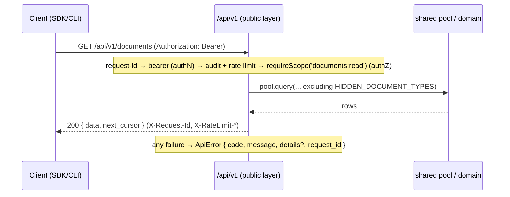
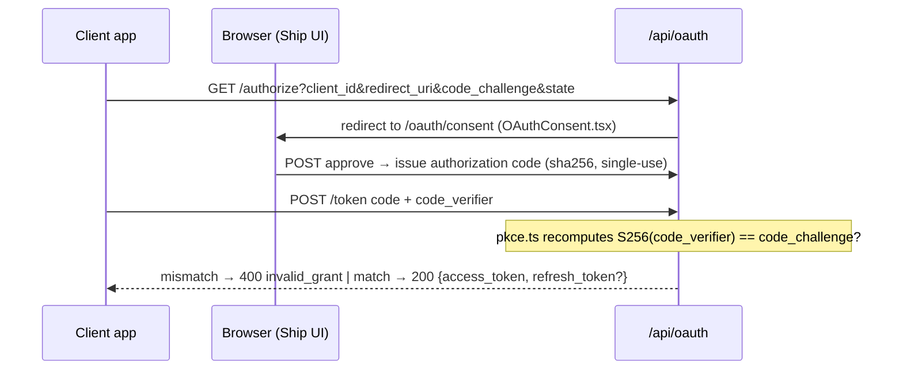
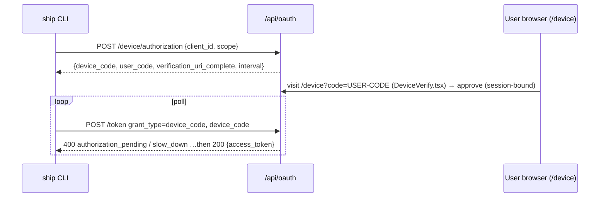
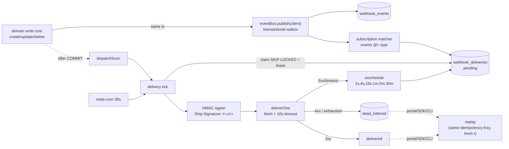

# Ship Platform — Architecture

> **Status.** This document reflects the system **as built**: the Plugforge gate (public
> `/api/v1`, OAuth 2.0 Authorization Code + PKCE, scopes, `ApiError`, generated OpenAPI 3.1,
> typed document-backed resources, `@ryanjagger/ship-sdk` v0.2.0), the RFC 8628 Device
> Authorization Grant and the `ship` CLI, **signed, retryable webhooks** (event bus, HMAC
> signing, retry/DLQ, replay, SDK verifier), **refresh-token rotation** (`offline_access`),
> **per-app/per-token rate limiting**, a **public-API audit trail**, the **Developer Portal**
> (a first-party OAuth app that dogfoods `/api/v1`), and the **Fleet agent rewire**
> (agent-as-citizen: the agent consumes the public API through the SDK over loopback HTTP).
> The one remaining **Planned** item from the PRD roadmap is the queue-backed delivery bus —
> documented so the module seam is visible before the code lands.

The public platform is a hermetic layer under `api/src/platform/`. It shares the database and
domain logic with Ship's internal `/api/` app but attaches its own authentication, scope
authorization, rate limiting, audit logging, request correlation, and error shape — and is
forbidden by lint from importing internal route handlers.

---

## Runtime Map

| Concern | Shipping behavior |
|---|---|
| Public API | `/api/v1/*`, bearer-token only, `ApiError` on every failure, `X-Request-Id` on responses |
| Internal app API | `/api/*` outside `/api/v1`, session cookies + CSRF, legacy response envelopes |
| OAuth | `/api/oauth/*`: Authorization Code + PKCE (web apps, public & confidential clients), Device Authorization Grant (CLI), `refresh_token` grant with rotation |
| Rate limiting | per-app + per-token token buckets backed by `public_api_rate_limit_buckets`; `X-RateLimit-*` headers; fail-open |
| Audit | one row per authenticated `/api/v1` request in `public_api_audit_logs`; queryable at `GET /api/v1/audit` (`audit:read` + workspace admin) |
| SDK/CLI | `@ryanjagger/ship-sdk` publishes the typed client and `ship` binary; CLI defaults to the production origin and `SHIP_API_URL` overrides it |
| OpenAPI | Generated from Zod schemas, served lazily, checked against the SDK operation manifest *and* compile-time contract-type guards |
| Webhooks | Transactional outbox at the domain-service seam, HMAC signatures, retry/DLQ, replay (incl. delivered rows), SDK verification helpers |
| Developer Portal | `/developer` UI; first-party public client minting 15-minute tokens at `POST /api/developer/token`; manages apps, connections, webhooks, deliveries, audit |
| Fleet agent | agent tools call `/api/v1` via the SDK over loopback HTTP with in-process-minted tokens for `client_ship_fleet_agent` |

---

## Module Layout

```
api/src/platform/
├── oauth/                         OAuth 2.0 authorization server (RFC 6749 + 7636 + 8628)
│   ├── apps.ts                    oauth_apps model: client_id/secret, client_type, createOAuthApp, find*
│   ├── admin-routes.ts            POST /api/admin/oauth-apps — admin registration (secret shown once)
│   ├── routes.ts                  /authorize, /token, /device/* endpoints (grant dispatch incl. refresh_token)
│   ├── authorize-request.ts       authorize-request validation (redirect_uri, scope subset)
│   ├── pkce.ts                    PKCE S256 challenge recomputation (RFC 7636)
│   ├── codes.ts                   authorization codes: sha256-hashed, short TTL, single-use
│   ├── device-codes.ts            device codes (RFC 8628): issue / poll / approve / deny
│   ├── tokens.ts                  issueAccessToken / validateAccessToken (1h TTL) + refresh tokens (30d, rotating, family revocation)
│   ├── connections.ts             workspace connections: live (app, user) token pairs — list + instant revoke
│   └── oauth-errors.ts            RFC 6749 §5.2 + 8628 token-endpoint error shapes
├── api/v1/                        Public REST API (versioned, contract-first)
│   ├── router.ts                  v1 entry: request-id → routes → 404/error handlers
│   ├── middleware/bearer.ts       authN: validates bearer token, attaches req.platform, then audit + rate limit
│   ├── middleware/require-scope.ts authZ: requireScope(scope) + authOnly() factories
│   ├── scopes/registry.ts         ScopeRegistry — scopes-as-data (served at GET /api/v1/scopes)
│   ├── rate-limit/                per-app + per-token token buckets (DB-backed, fail-open)
│   ├── audit/                     beginAudit middleware + recordPublicApiRequest / queryPublicApiAudit
│   ├── routes/{me,documents,typed-documents}.ts        resource handlers (call the shared DB directly)
│   ├── routes/{comments,document-history}.ts           document comments + cross-document field history
│   ├── routes/{webhooks,webhook-deliveries}.ts         subscription CRUD + delivery log/replay (webhooks:manage)
│   ├── routes/{apps,connections,audit,scopes}.ts       portal management surface (apps:manage / connections:manage / audit:read)
│   ├── schemas/…                  Zod schemas (error, document, typed-document, me, webhook, app, connection, comment, document-history, audit, scope) — also feed OpenAPI
│   ├── openapi/{spec,export}.ts   OpenAPI 3.1 generated from the schemas above
│   ├── errors.ts                  ApiError contract + sendApiError
│   ├── error-middleware.ts        404 + global handler — guarantees ApiError on every failure
│   ├── request-id.ts              UUID per request → req.platformRequestId + X-Request-Id
│   ├── rate-limit.ts              reshapes the global per-IP limiter's 429 into ApiError (v1 only)
│   └── cursor.ts                  opaque keyset cursor encode/decode ({id, created_at})
└── webhooks/                      Outbound webhook pipeline (publish → sign → deliver → retry → DLQ)
    ├── registry.ts                event-type registry: families, required read scopes, deferred flags
    ├── events.ts                  ShipWebhookEvent envelope + buildEvents (created/updated/deleted + semantic)
    ├── event-bus.ts               IEventBus + InProcessEventBus (transactional-outbox publish + dispatchSoon)
    ├── subscriptions.ts           webhook_subscriptions model (per app+workspace; encrypted secret + fingerprint; created_by owner)
    ├── deliveries.ts              webhook_deliveries/attempts: claim (SKIP LOCKED + lease), transitions, replay
    ├── dispatcher.ts              deliverOne: decrypt → sign → fetch(timeout) → classify → record → transition
    ├── retry.ts                   retry schedule (1s..30m + jitter) + 2xx/4xx/5xx classification
    ├── scheduler.ts               node-cron 30s delivery tick (env-gated WEBHOOKS_DELIVERY_ENABLED)
    ├── signing.ts                 HMAC-SHA256 sign/verify (Ship-Signature: t=,v1=)
    ├── crypto.ts                  AES-256-GCM secret encryption + fingerprint (WEBHOOK_SECRET_ENC_KEY)
    ├── target-url.ts              SSRF screen for target URLs (create/update + re-check at dispatch)
    └── validate.ts                subscription validation against the TARGET app's requested_scopes

api/src/services/fleetgraph/api-client.ts   Fleet API client: in-process token mint, loopback HTTP, identity-keyed cache
api/src/services/fleetgraph/tools/          agent read/write tools — all routed through the SDK → /api/v1
api/src/services/fleetgraph/service-user.ts fleet@ship.system service-user lookup (seeded by migration 062)

sdk/src/index.ts                   @ryanjagger/ship-sdk (v0.2.0) — zero-dep, injectable fetch
sdk/src/webhooks.ts                verifyWebhook (HMAC verify; Express + Fetch handlers)
sdk/src/auth/                      OAuth plumbing: token stores (memory/file/localStorage), PKCE, authorize/exchange/refresh flows
sdk/src/generated/                 openapi-typescript output from docs/openapi.json (pnpm gen:types — never hand-edited)
sdk/src/contract-types.ts          compile-time mutual-assignability guards: SDK types ⇔ generated OpenAPI types
sdk/src/cli/                       `ship` binary packaged by @ryanjagger/ship-sdk
sdk/src/cli/config.ts              CLI default origin + SHIP_API_URL / SHIP_CLIENT_ID overrides
sdk/src/cli/commands/              login (device flow), resources (typed list/get/create/update/delete), docs, webhooks

web/src/pages/DeveloperPortal.tsx  Developer Portal UI (apps / connections / webhooks / deliveries / audit tabs)
web/src/lib/portal-client.ts       portal token mint + cache (keyed userId:workspaceId)
```

Notes: there are **two rate-limit layers** — the legacy global per-IP limiter (whose 429 is
reshaped into `ApiError` by `api/v1/rate-limit.ts`) plus the new per-app/per-token buckets in
`api/v1/rate-limit/` (migration `057`). **Audit** is now wired into every authenticated
`/api/v1` request (migration `058`); the older internal `api/src/services/audit.ts` still
exists and carries agent semantics the HTTP log can't (see Agent-as-Citizen). The webhook
**developer-portal UI** has shipped ([#67](https://github.com/ryanjagger/ship/issues/67) closed).

---

## SOLID Rationale

- **OCP — `scopes/registry.ts`.** Scopes are data, not branches. A new scope is registered at
  module load; `middleware/require-scope.ts` reads the registry and never changes to add one.
  The registry is itself a public resource (`GET /api/v1/scopes`). The OpenAPI generator is open
  the same way: `openapi/spec.ts` `buildRegistry()` registers each route's Zod schemas, so adding
  a route extends the spec without editing the generator.
- **SRP — the v1 middleware chain.** Each middleware owns exactly one concern: `bearer.ts`
  (authentication — which also sequences `beginAudit()` and `applyRateLimit()` after the token
  check), `require-scope.ts` (authorization), `request-id.ts` (correlation), `audit/`
  (request logging), `rate-limit/` (quota), `error-middleware.ts` (error shape). Routes compose
  them; none of them knows about the others.
- **ISP — resource-segregated SDK clients.** `ShipClient` exposes `.documents` (with nested
  `.documents.comments`) plus typed clients (`.wikiPages`, `.issues`, `.programs`, `.projects`,
  `.sprints`, `.people`, `.weeklyPlans`, `.weeklyRetros`, `.standups`, `.weeklyReviews`) and
  management clients (`.webhooks`, `.apps`, `.connections`, `.audit`, `.scopes`,
  `.documentHistory`) as separate interfaces, so a consumer that only reads one resource depends
  on that resource surface alone.
- **DIP — injected `fetch` and `IEventBus`.** The SDK depends on the `fetch` abstraction, not a
  concrete HTTP library: `new ShipClient({ token, fetch? })` and the device helpers take
  `fetch`/`sleep`. That inversion is why the API test suite drives the real `ShipClient` through a
  supertest-backed `fetch` with no TCP server — and why the Fleet agent can call the same client
  over loopback HTTP. Domain write services depend on the `IEventBus` interface
  (`webhooks/event-bus.ts`), not a concrete deliverer. The shipping `InProcessEventBus` writes
  events + deliveries inside the write transaction; a queue-backed implementation is a drop-in
  replacement (Planned) with no change to the call sites.
- **LSP — swappable `fetch` and event bus.** The real `globalThis.fetch`, the supertest fetch,
  and the loopback Fleet transport are substitutable behind one contract; tests pass with any.
  Likewise `IEventBus.publish` takes the transaction client, so the in-process bus and a future
  queue-backed bus are Liskov-substitutable behind one `publish(client, events)` contract.

---

## Composition Root

There is no DI container; composition is Express middleware-chaining plus a few module
singletons (`pool`, `scopeRegistry`, the cached OpenAPI document). The wiring lives in
`api/src/app.ts`:

```ts
// api/src/app.ts — order matters
const publicCors = cors({ origin: publicCorsOriginOption(corsOrigin), credentials: true });
app.use('/api/oauth/token', publicCors);
app.use('/api/oauth/device/authorization', publicCors);
app.use('/api/v1', publicCors);

const apiLimiter = rateLimit({ /* ... */ handler: apiRateLimitHandler });
app.use('/api/', apiLimiter);                              // global per-IP limiter

app.use('/api/oauth', oauthPublicRouter);                  // public: /authorize, /token, /device/*
app.use('/api/oauth', conditionalCsrf, oauthConsentRouter);// session+CSRF: consent + /device decision
// conditionalCsrf skips CSRF when Authorization: Bearer is present.

app.use('/api/developer', conditionalCsrf, developerRoutes);// session-authed portal token mint
app.use('/api/v1', v1Router);                              // public Platform API
```

`v1Router` (`api/v1/router.ts`) composes per request: `request-id` → resource routes (each
`bearerAuth` → `requireScope(...)`/`authOnly()` → handler) → `notFoundHandler` →
`errorHandler`. Inside `bearerAuth`, after the token validates: `beginAudit()` registers a
`res.on('finish')` recorder, then `applyRateLimit()` may 429 before the handler runs.
`publicCors` is mounted before the global `/api/` limiter so public OAuth/API preflights return
before rate-limit accounting. The OpenAPI document is built lazily on first request and cached.

Boot-time wiring in `api/src/index.ts` runs *after* `server.listen` (never in `createApp`, so
unit tests that import the app don't spin a real cron timer):
`configureFleetApiClient({ baseUrl: SHIP_SELF_URL || http://127.0.0.1:PORT })` points the Fleet
agent's SDK at this process over loopback, then `startScheduler()` (FleetGraph drift sweep,
4-minute cron, gated by `FLEETGRAPH_SWEEP_ENABLED`) and `startWebhookScheduler()` (gated by
`WEBHOOKS_DELIVERY_ENABLED`). Both gates are read once at boot. The event bus itself is a module
singleton (`eventBus`, `webhooks/event-bus.ts`) the domain write services publish through; the
scheduler registers a `dispatchSoon` hook so a just-committed write also triggers an immediate
delivery pass.

**Sibling test wiring.** The "in-memory" analog today is the SDK suite injecting a
supertest-backed `fetch` into `ShipClient` (no real server), plus the limiter's test-env bump
(`max: 10000`) so functional tests don't trip the global limit. The webhook suite is the same
shape: `dispatchSoon` is a no-op until the scheduler registers its hook, so write-boundary tests
assert the durable `webhook_events`/`webhook_deliveries` rows without any network, and dispatcher
tests stub `globalThis.fetch`.

---

## Public / Internal Boundary

The split is enforced by lint, not convention. `eslint.config.mjs` (`:110`) applies a
`no-restricted-imports` **error** to `api/src/platform/**` blocking `../**/routes/*` and
`../**/routes/**` — a public route physically cannot import an internal handler. v1 routes reach
data through the shared `pool` (`db/client.js`) directly and reuse the shared
`HIDDEN_DOCUMENT_TYPES` exclusion from `@ship/shared`, so the broad public document filter can't
drift from the internal one.



Auth, scope, rate limit, audit, request-id, and the `ApiError` shape attach **only** at the
public layer; the internal `/api/*` routes use session cookies + CSRF and the internal
`{ success, data }` envelope. **Webhook publication** attaches one layer deeper, at the
domain-service seam: the typed-document and issue service cores
(`api/src/services/typed-documents-service.ts`, `issues-service.ts`) call `eventBus.publish` on
the same transaction client as the mutation, so *any* caller of those cores — public v1 routes,
internal routes, the Fleet agent — produces identical events, and the route layer never
constructs deliveries.

### Rate limiting

Two DB-backed token buckets (`public_api_rate_limit_buckets`, migration `057`), checked inside
`bearerAuth` after the token validates: a **per-app** bucket (default 600 req/min,
`PLATFORM_RATE_LIMIT_APP_PER_MIN`; keyed per-workspace for system apps) and a **per-token**
bucket (default 120 req/min, `PLATFORM_RATE_LIMIT_TOKEN_PER_MIN`). Continuous refill over a
60-second window; refill+consume is a single atomic row-locked statement; the request passes
only when *both* buckets have capacity. Responses carry `X-RateLimit-Limit/Remaining/Reset`;
429s are `ApiError` with `Retry-After`. The check **fails open** — a bucket-table outage never
takes down the API (the global per-IP limiter still applies).

### Audit trail

`beginAudit()` (in `bearerAuth`) records one row per authenticated request to
`public_api_audit_logs` (migration `058`) on `res.finish`: client/app/token/user/workspace ids,
method, the route **template** (`/api/v1/issues/:id`, not the raw URL — no ID leakage), matched
scope, status, latency, request-id, IP, and user-agent. **Never** bodies, tokens, or secrets.
Writes are non-fatal (fire-and-forget). Retention defaults to 90 days via `pruneAuditLogs()`.
Workspace admins query it at `GET /api/v1/audit` (`audit:read`) — the Developer Portal's Audit
tab, which excludes the portal's own traffic by default (`exclude_client_id`).

---

## Typed Document-Backed Resources

The canonical storage model is still the unified `documents` table. Public v1 exposes that model
in two layers:

- `GET/POST /api/v1/documents` is the broad compatibility surface. It returns the public document
  DTO with `document_type`, `properties`, and optional `content`. Nested under it:
  `GET/POST /api/v1/documents/:id/comments` (threaded via `parent_id`), and the cross-document
  `GET /api/v1/document-history` (up to 100 `document_id`s per call — the activity-feed pattern —
  with field-level changes and provenance incl. `automated_by`).
- Typed collections fix the backing `document_type` by route and return native DTOs instead of
  leaking `document_type` / raw `properties`:
  `/wiki-pages`, `/issues`, `/programs`, `/projects`, `/sprints`, `/people`, `/weekly-plans`,
  `/weekly-retros`, `/standups`, `/weekly-reviews`.

Each typed resource is declared as data in `schemas/typed-document.ts`: path, schema name,
backing `document_type`, read/write scopes, Zod create/update/response schemas, and mapper
functions. `routes/typed-documents.ts` loops over that registry to mount equivalent REST handlers
for every collection; `openapi/spec.ts` loops over the same registry to register concrete schemas
such as `Issue`, `CreateIssue`, `Sprint`, and `WikiPageListResponse`. Typed list endpoints accept
relational and temporal filters (`belongs_to`, `belongs_to_type`, `state`,
`updated_before/after`, and `visibility=workspace` to exclude private documents).

Scopes are per resource with broad migration superscopes:

| Route family | Narrow scopes | Broad superscope |
|---|---|---|
| `/api/v1/issues` | `issues:read`, `issues:write` | `documents:read`, `documents:write` |
| `/api/v1/sprints` | `sprints:read`, `sprints:write` | `documents:read`, `documents:write` |
| `/api/v1/wiki-pages`, `/programs`, `/projects`, etc. | matching resource scopes | `documents:*` |
| `/api/v1/documents/:id/comments` | `comments:read`, `comments:write` | `documents:read`, `documents:write` |

Typed create/update requests are translated into `documents.title`, `documents.content`, and
known JSONB `properties` keys inside the **domain service cores**
(`createTypedDocumentCore` / `updateTypedDocumentCore` / `deleteTypedDocumentCore` in
`api/src/services/typed-documents-service.ts`), which also publish webhook events on the same
transaction and hand back post-commit side effects the route runs via
`runTypedDocumentSideEffects`. The route then reloads the row with computed columns before
responding, so the public DTO reflects database state rather than the request body. Guarded
transitions return `409 conflict` (e.g. closing a parent issue with open children requires
`confirm_orphan_children: true`).

Relational fields are derived from `document_associations`, not stubbed:

- `Issue.belongs_to` is returned from real associations. Typed issue create/update accepts
  `belongs_to`, validates same-workspace targets (`program`, `project`, `sprint`, or parent
  `issue`), and writes/syncs the association rows in the same transaction as the issue document.
- Program and project `issue_count` / `sprint_count` are same-workspace counts over associated
  issue and sprint documents.
- Sprint `issue_count`, `completed_count`, `started_count`, `has_plan`, `has_retro`,
  `retro_outcome`, and `retro_id` are computed from associated issues, weekly plans, and retros.
- Project `inferred_status` is derived on read (`archived` > `completed` > current/future sprint
  allocation > `backlog`) rather than reading a raw `properties.status` value.

This keeps the public API native to each resource while preserving the internal document-backed
storage model and the platform boundary rule: v1 still does not import internal Express route
handlers.

---

## Extension Checklist

When adding public platform behavior, keep the contract changes flowing in one direction: schema
and registry data first, route behavior second, SDK/CLI third.

- **New typed document resource:** add the schema, DTO mapper, `toCreate`, and `toUpdate` entry in
  `schemas/typed-document.ts`; register scopes in `scopes/registry.ts`; rely on
  `routes/typed-documents.ts` and `openapi/spec.ts` to mount and document the resource from that
  registry entry.
- **New custom v1 route:** define Zod request/response schemas, route middleware order
  (`bearerAuth` then `requireScope`/`authOnly`), and the OpenAPI path in `openapi/spec.ts`; return
  `ApiError` for all non-2xx cases.
- **SDK parity:** add the SDK method in `sdk/src/index.ts` and record the operation in
  `sdk/src/manifest.ts`. Regenerate `docs/openapi.json` and the generated types (`pnpm gen:types`);
  the SDK contract test compares the manifest to `docs/openapi.json`, and `contract-types.ts`
  fails type-check if hand-written SDK types drift from the generated schemas — so a public
  operation without an SDK decision fails loudly twice.
- **CLI parity:** expose only workflows that make sense as repeatable terminal commands; use
  `loadConfig()` so `SHIP_API_URL` and `SHIP_CLIENT_ID` behave consistently across commands.
- **Webhook parity:** for typed writes, publish from the domain service core (not the route) using
  events built from the public DTO; add semantic events only when the transition is observable at
  write time, and gate subscription eligibility with the resource's read scope.
- **Tests:** cover API route behavior, generated OpenAPI shape, SDK contract drift, and CLI
  argument/config behavior when the public surface changes.

---

## OAuth Flows

**Authorization Code + PKCE (web apps).** Tokens are opaque `ship_at_*` strings, SHA-256-hashed
in `access_tokens` (1h TTL, no JWT). Clients are **confidential** (secret required at `/token`)
or **public** (`client_type` column, migration `059`; PKCE-only, no secret) — confidential
clients must hold a secret, public clients must not.



**Refresh-token rotation (`offline_access`).** A grant that includes the `offline_access` scope
also returns a refresh token (30-day TTL). `grant_type=refresh_token` at `/token` **rotates** on
every use: the old token is stamped `used_at` and linked via `replaced_by_token_id` within a
`family_id`; **reusing** an already-spent refresh token revokes the whole family (treated as
credential theft). Works across Authorization Code, Device, and Refresh grants. The Slack
integration uses this; the CLI device flow does *not* request `offline_access` — users re-run
`ship login` on expiry.

**Device Authorization Grant (RFC 8628, the CLI).** Public client — `client_id` only, no
secret — and opt-in per app via `oauth_apps.allow_device_flow`.



The device code is sha256-hashed at rest and consumed atomically (single-use); too-fast polls
get `slow_down`, expiry gives `expired_token`, denial gives `access_denied`.

**System apps.** Three first-party public clients are seeded by migrations:

| client_id | Seeded | Token path | Scopes |
|---|---|---|---|
| `client_ship_cli` | `053` | Device grant | resource scopes + `webhooks:manage` (`056`) |
| `client_ship_developer_portal` | `061` | `POST /api/developer/token` — session-authed first-party exchange, 15-min token, no refresh (the session cookie *is* the refresh credential) | `apps:manage`, `connections:manage`, `audit:read`, `webhooks:manage` |
| `client_ship_fleet_agent` | `062` | in-process mint (no HTTP exchange), 15-min token | resource read/write scopes (see Agent-as-Citizen) |

Migration `062` also seeds the `fleet@ship.system` **service user** (NULL `password_hash`, so
login paths reject it; no workspace memberships) for the scheduled drift sweep.

**Connections.** `oauth/connections.ts` models the live (app, user) token pairs per workspace —
union of scopes, token count, first-authorized and last-used timestamps. Revoking a connection
sets `revoked_at` on all the pair's tokens; since `validateAccessToken` checks `revoked_at IS
NULL` on every request, revocation is instant. Exposed at `GET/DELETE /api/v1/connections…`
(`connections:manage` + workspace admin) and surfaced in the portal's Connections tab.

---

## Webhook Pipeline

Signed, retryable, replayable webhooks for public `/api/v1` resource events, built on the public
DTO model — there are **no public `document.*` events**. Backing tables (migrations `054`/`055`):
`webhook_subscriptions` (incl. `created_by` owner), `webhook_events`, `webhook_deliveries`,
`webhook_delivery_attempts`.



**Transactional outbox at the domain seam.** The typed-document and issue service cores
(`api/src/services/typed-documents-service.ts`, `issues-service.ts`) call
`eventBus.publish(client, events)` on the *same* transaction client as the document mutation,
inserting the `webhook_events` row and fanning out a `webhook_deliveries` row per matching active
subscription. So events and the document change commit atomically: none is lost on a crash, none
is emitted for a rolled-back write — and every caller of the cores (public v1, internal routes,
the Fleet agent) emits identical events. Routes never construct deliveries; they run the
returned post-commit side effects (`runTypedDocumentSideEffects` → `dispatchSoon`). Events are
built from the public DTO (`buildEvents` over `toResponse`).

**Event model.** Every mutable typed resource emits `created`/`updated`/`deleted`. Semantic events
fire in addition to `updated` on a workflow transition — `issue.assigned`, `issue.status_changed`,
and `weekly_plan|weekly_retro|standup .submitted` — detected by per-resource `semanticEvents(before,
after)` hooks over the before/after DTOs. `sprint.started/completed` and `project.completed` are
registered but **deferred** (they depend on read-time-inferred status with no write to hook). Delete
events carry a **tombstone** (`{ id, object, deleted: true }`), not a stale snapshot. The registry
also gates *who may subscribe*: each family requires its read scope (`person.*` requires
`people:read`, with no `documents:read` fallback). When a subscription is created *on behalf of an
app* (the portal's per-app path), `webhooks/validate.ts` checks the **target app's**
`requested_scopes` — not the caller's token — so fan-out can't deliver payloads the app itself
isn't scoped to read.

**Delivery, retry, DLQ.** A 30-second `node-cron` tick claims due deliveries with `FOR UPDATE SKIP
LOCKED` + a lease bump (so a crashed mid-delivery row reappears) and runs `deliverOne` *outside*
any transaction — the HTTP `fetch` never holds a DB connection. The first attempt is inline via
`dispatchSoon` (sub-second), so the cron tick is the durable backstop for the `4s…30m` retries.
2xx → `delivered`; 5xx/timeout/network → retry on the `1s,4s,16s,1m,5m,30m` schedule (+jitter); 4xx
or exhaustion → `dead_lettered`. Every attempt is appended to `webhook_delivery_attempts`.

**Signing & verification.** `Ship-Signature: t=<unix>,v1=<hex-hmac>` over `<timestamp>.<raw-body>`
(HMAC-SHA256). The body is `JSON.stringify`'d once and the same bytes are signed and sent. Signing
secrets are stored AES-256-GCM-encrypted (HMAC needs the raw secret, so bcrypt is unusable) plus a
one-way `secret_fingerprint` for display; the raw secret is shown only on create/rotate. The SDK's
`verifyWebhook()` mirrors the signer exactly (constant-time, 5-minute tolerance, raw-body).

**Replay.** `delivered`, `failed`, and `dead_lettered` rows can all be replayed —
`POST /api/v1/webhook-deliveries/:id/replay` (app-holder path) or
`POST /api/v1/apps/:appId/deliveries/:deliveryId/replay` (workspace-admin/portal path). Replay
spawns a new linked `pending` delivery (`replay_of_delivery_id`) reusing the original event — the
`id` / `Idempotency-Key` are preserved while the signature timestamp is fresh at send time. The
source row is stamped `replayed` only when it wasn't `delivered`, preserving the delivered audit
trail.

**Security gates.** Fan-out mirrors the read path's visibility rule: a `private` document is only
delivered to subscriptions whose owner (`webhook_subscriptions.created_by`, the authorizing user)
created it, so an app can't receive private DTOs its token couldn't read. Target URLs are
SSRF-screened at create/update *and* re-checked at dispatch (`target-url.ts`) — non-http(s)
schemes and loopback/private/link-local/metadata hosts are rejected, with a
`WEBHOOK_ALLOW_PRIVATE_TARGETS` escape hatch for local dev only.

**Tooling.** Subscriptions, the delivery log, and replay are managed three ways: the SDK
(`client.webhooks` / `client.webhooks.deliveries`, plus the per-app `client.apps` surface), the
CLI (`ship webhooks list/create/delete/replay`, plus `ship webhooks tail` to live-stream the
delivery log), and the **Developer Portal** UI. SDK/CLI access requires the `webhooks:manage`
scope; the first-party CLI client requests it as of migration `056`, so users re-run `ship login`
to pick it up.

---

## Developer Portal

`web/src/pages/DeveloperPortal.tsx` — the browser management surface for the platform, and a
deliberate **dogfooding exercise**: the portal is itself a first-party OAuth public client
(`client_ship_developer_portal`, migration `061`) that consumes `/api/v1` through the published
`ShipClient`, exactly like a third-party app. Five tabs:

1. **Apps** — create/list/delete OAuth apps, rotate secrets (revealed once on create/rotate).
2. **Connections** — apps holding live tokens in the workspace; instant revoke.
3. **Webhooks** — per-app subscription CRUD, gated by the app's `requested_scopes`
   (`webhooks/validate.ts`).
4. **Deliveries** — delivery log with status filter, attempt history, and replay
   (delivered/failed/dead-lettered).
5. **Audit** — the public-API request log (`GET /api/v1/audit`), excluding the portal's own
   traffic by default.

**Token plumbing.** The session-authed UI mints a 15-minute bearer token at
`POST /api/developer/token` (no refresh token — the session cookie is the refresh credential).
`portal-client.ts` caches the token keyed **`${userId}:${workspaceId}`** — any identity change
(logout, user switch) misses the cache and re-mints, so a token can never ride across users
within its TTL; `logout()` also clears it eagerly.

---

## SDK Surface

`@ryanjagger/ship-sdk` (`sdk/src/index.ts`), **v0.2.0** — zero runtime deps, injectable `fetch`.

| Surface | Status | Notes |
|---|---|---|
| `new ShipClient({ token, baseUrl?, fetch? })` | Pre-1.0 | constructor; injectable transport |
| `client.me()` | Pre-1.0 | `GET /api/v1/me` → typed user + workspace |
| `client.documents.{list,get,create}` + `client.documents.comments.{list,create}` | Pre-1.0 | broad document client + threaded comments |
| `client.wikiPages`, `.issues`, `.programs`, `.projects`, `.sprints`, `.people`, `.weeklyPlans`, `.weeklyRetros`, `.standups`, `.weeklyReviews` | Pre-1.0 | typed resource clients returning native DTOs; list filters: `belongs_to`, `belongs_to_type`, `state`, `updated_before/after`, `visibility` |
| `client.documentHistory.list()` | Pre-1.0 | cross-document field history (≤100 ids/call) with provenance (`automated_by`) |
| `client.apps`, `.connections`, `.audit`, `.scopes` | Pre-1.0 | portal management surface (`apps:manage` / `connections:manage` / `audit:read`) |
| `client.webhooks.{list,get,create,update,delete,rotateSecret}` + `client.webhooks.deliveries.{list,get,replay}` | Pre-1.0 | webhook subscription + delivery-log client |
| `client.documents.iterate()`, `client.<resource>.iterate()` | Pre-1.0 | async-generator pagination; hides cursor walking, preserves filters across pages |
| `ShipSDKError` discriminated union (`.kind`) + `toShipSDKError()` | Pre-1.0 | typed errors: `auth` / `rate_limit` / `not_found` / `validation` / **`conflict` (409, new in 0.2.0 — exhaustive switches must add it)** / `server` |
| `requestDeviceAuthorization()`, `pollDeviceToken()`, `refreshAccessToken()` | Pre-1.0 | module-level auth helpers (pre-auth); refresh exchange new in 0.2.0 |
| `sdk/src/auth/` | Pre-1.0 | token stores (`MemoryTokenStore`, `FileTokenStore` → `~/.ship/`, `LocalStorageTokenStore`), PKCE, `buildAuthorizeUrl` / `exchangeAuthorizationCode`, loopback (RFC 8252) + browser redirect adapters |
| `verifyWebhook(headers, rawBody, secret, opts?)` | Pre-1.0 | HMAC-SHA256 verify; Express + Fetch headers; constant-time; 5-min tolerance |
| `ship login`, `ship wiki/issues/projects/… <list|get|create|update|delete>`, `ship docs`, `ship webhooks list/create/delete/replay/tail` | Pre-1.0 | CLI: device-flow login persists to `~/.ship/credentials.json`; `tail` live-streams the delivery log |

The broad `.documents` client remains available for migration and generic integrations. Typed
clients are the preferred public surface when the caller knows the resource type.

---

## Contract and Release Gates

The public platform has four drift checks that should move together:

- `docs/openapi.json` is the committed public API snapshot. Regenerate it with
  `pnpm --filter @ship/api openapi:export` when route schemas or response DTOs change.
- `sdk/src/manifest.ts` maps every OpenAPI operation to an SDK method or an explicit unsupported
  decision; the SDK contract test walks `docs/openapi.json` and fails on any unmapped operation.
  This is the authoritative SDK coverage ledger.
- `sdk/src/generated/` is `openapi-typescript` output from `docs/openapi.json` (`pnpm gen:types`,
  never hand-edited); `sdk/src/contract-types.ts` asserts mutual assignability between
  hand-written SDK types and the generated schemas, so DTO drift fails at type-check time.
- `sdk/src/cli/config.ts` owns the published CLI defaults. The stable CLI default is the
  production origin; local and staging usage must go through `SHIP_API_URL`.

Before publishing the SDK, run the SDK tests and build, verify production `/health`, and smoke the
built `ship` binary with no `SHIP_API_URL` to ensure it starts the production device flow.

---

## Agent-as-Citizen

The Fleet agent is a platform citizen — same scopes, same rate limits, same audit trail as any
external app. This is a **full cutover**, not a flag: there is no fallback path to direct
domain-service calls.

```
agent tool → withFleetClient (in-process token mint, identity-keyed cache)
           → @ryanjagger/ship-sdk → loopback HTTP → /api/v1 → domain service cores
                                          └─ public_api_audit_logs row + document_history.automated_by
```

- **Fleet API client** (`api/src/services/fleetgraph/api-client.ts`): mints 15-minute tokens for
  `client_ship_fleet_agent` **in-process** (no HTTP token exchange, modeled on the portal's
  client) and calls `/api/v1` over loopback HTTP — `configureFleetApiClient` in `api/src/index.ts`
  points it at `http://127.0.0.1:PORT`, with `SHIP_SELF_URL` overriding where loopback is wrong.
  The token cache is strictly keyed `${userId}:${workspaceId}` (chat turns mint for the acting
  user; the sweep mints for the service user) and re-mints exactly once on a 401; 403s propagate.
- **Tools**: reads (`tools/read.ts` — focal doc, associations, people, recent activity via
  `standups` + `comments` + `documentHistory`) and writes (`tools/write.ts` — create/patch issue,
  patch project, post comment) all go through the SDK. Reads use `visibility: 'workspace'` so
  shareable context never absorbs private issues; writes pass the same authorization that rejects
  human users — v1 has no admin bypass.
- **Drift sweep**: runs as the `fleet@ship.system` service user (migration `062`; NULL password,
  no workspace memberships, `is_super_admin` only neutralizes the membership check in
  `validateAccessToken` — each token is still bound to one workspace, the app's scopes, 15-min
  TTL). The sweep sees workspace-visible documents only, which is privacy-positive: private
  projects drop out of drift detection. Scheduled by `startScheduler()` (4-minute `node-cron`,
  gated by `FLEETGRAPH_SWEEP_ENABLED`, per-workspace opt-in via settings); single-flight per
  workspace via session-scoped advisory locks — no transaction is held across LLM calls.
- **Provenance is dual-layer.** The HTTP request lands in `public_api_audit_logs` like any app's;
  the internal `audit_logs` row carries the agent semantics HTTP can't
  (`agent_initiated: true`, `approved_by: userId`); and field changes record
  `document_history.automated_by = 'client_ship_fleet_agent'` (the OAuth client_id), so
  agent-driven edits are attributable in document history.

---

## Failure Modes

- **CLI credential store corrupted / token invalid.** `~/.ship/credentials.json` is a single
  `0600` JSON blob; a bad or expired token surfaces as a `401` and the CLI tells the user to run
  `ship login`, which overwrites the file. No partial-state recovery needed.
- **CLI points at the wrong origin.** The stable default is production, but every command resolves
  `baseUrl` through `loadConfig()`. Set `SHIP_API_URL` to retarget local, staging, or emergency
  environments without republishing the SDK.
- **Access token expired.** 1h TTL: `validateAccessToken` returns a distinct `401 token_expired`
  (not generic invalid). Integrations that requested `offline_access` rotate their refresh token;
  the CLI and portal re-authenticate (re-`ship login` / session re-mint).
- **Refresh token replayed.** Rotation links tokens in a `family_id`; reusing a spent refresh
  token revokes the entire family — a stolen-then-replayed token kills the thief's access too.
- **Rate-limit bucket table unavailable.** The per-app/per-token check fails **open** — an outage
  in `public_api_rate_limit_buckets` never takes down the API; the global per-IP limiter still
  applies. Audit writes are likewise non-fatal (logged to stderr only).
- **OpenAPI generator throws.** The spec is generated lazily and cached, **off** the boot
  critical path — if `buildRegistry()` throws, only `GET /api/v1/openapi.json` 500s (as a proper
  `ApiError`); the rest of the API keeps serving. Boot does not depend on spec generation.
- **Device code expired or replayed.** Single-use atomic consume means a replayed `device_code`
  gets `invalid_grant`; past its 10-minute TTL it gets `expired_token`; a wrong client polling
  someone else's code gets `invalid_grant` without burning it for the owner.
- **Webhook delivery process crashes mid-batch.** Deliveries are durable rows, not in-memory work.
  The claim leases a row by pushing `next_attempt_at` 60s out, so a row whose process dies
  re-appears on the next tick — at-least-once delivery, subscribers dedupe by event `id` /
  `Idempotency-Key`. `dispatchSoon` failing only defers to the cron tick; correctness never
  depends on it.
- **Webhook signing secret rotated mid-flight.** Rotation re-encrypts the stored secret; in-flight
  deliveries sign with whatever secret is current at send time, and the delivery log records the
  outcome. `WEBHOOK_SECRET_ENC_KEY` itself must stay stable per environment — rotating *it* makes
  existing encrypted secrets undecryptable, surfaced as a per-delivery dead-letter with a clear
  error, never a crash.
- **Fleet agent token expired/revoked mid-task.** `withFleetClient` re-mints once on a 401 and
  retries; a 403 propagates (real authorization failure, not a stale token). The drift sweep's
  advisory lock is session-scoped, so a crashed sweep frees its workspace on disconnect.
