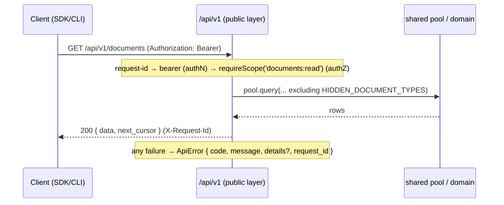
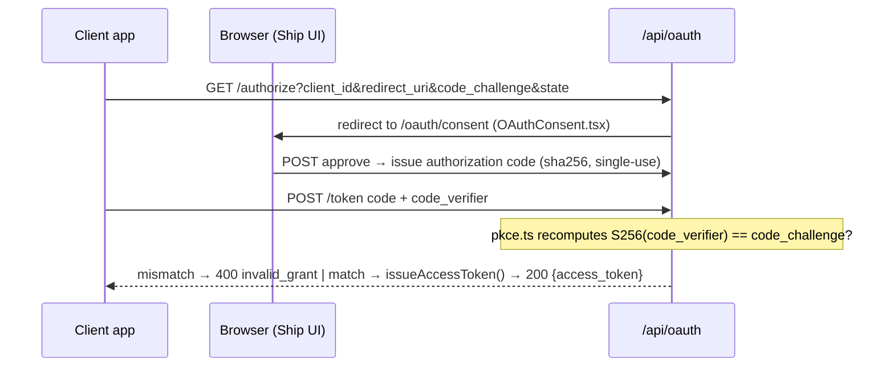
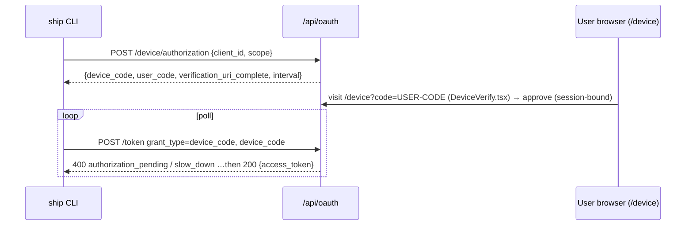
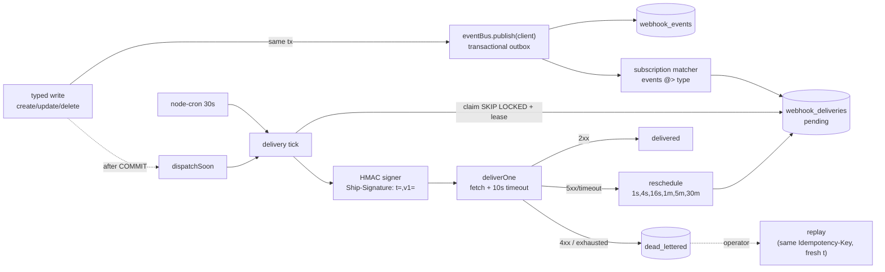

# Ship Platform — Architecture

> **Status.** This document reflects the system **as built**: the Plugforge MVP
> gate (public `/api/v1`, OAuth 2.0 Authorization Code + PKCE, scopes, `ApiError`, generated
> OpenAPI 3.1, typed document-backed resources, `@ryanjagger/ship-sdk`), the RFC 8628
> Device Authorization Grant and the `ship` CLI, plus **signed, retryable webhooks** (event bus,
> HMAC signing, retry/DLQ, replay, SDK verifier). Sections marked **Planned** track the
> remaining PRD roadmap (agent-as-citizen, refresh rotation, queue-backed delivery, webhook
> developer-portal UI — [#67](https://github.com/ryanjagger/ship/issues/67)) and are **not yet
> implemented** — they are documented so the contract and module seams are visible before the
> code lands.

The public platform is a hermetic layer under `api/src/platform/`. It shares the database and
domain logic with Ship's internal `/api/` app but attaches its own authentication, scope
authorization, request correlation, and error shape — and is forbidden by lint from importing
internal route handlers.

---

## Module Layout

```
api/src/platform/
├── oauth/                         OAuth 2.0 authorization server (RFC 6749 + 7636 + 8628)
│   ├── apps.ts                    oauth_apps model: client_id/secret, createOAuthApp, find*
│   ├── admin-routes.ts            POST /api/admin/oauth-apps — admin registration (secret shown once)
│   ├── routes.ts                  /authorize, /token, /device/* endpoints (grant dispatch)
│   ├── authorize-request.ts       authorize-request validation (redirect_uri, scope subset)
│   ├── pkce.ts                    PKCE S256 challenge recomputation (RFC 7636)
│   ├── codes.ts                   authorization codes: sha256-hashed, short TTL, single-use
│   ├── device-codes.ts            device codes (RFC 8628): issue / poll / approve / deny
│   ├── tokens.ts                  issueAccessToken / validateAccessToken (SHA-256, 1h TTL)
│   └── oauth-errors.ts            RFC 6749 §5.2 + 8628 token-endpoint error shapes
├── api/v1/                        Public REST API (versioned, contract-first)
│   ├── router.ts                  v1 entry: request-id → routes → 404/error handlers
│   ├── middleware/bearer.ts       authN: validates the bearer token, attaches req.platform
│   ├── middleware/require-scope.ts authZ: requireScope(scope) + authOnly() factories
│   ├── scopes/registry.ts         ScopeRegistry — scopes-as-data
│   ├── routes/{me,documents,typed-documents}.ts  resource handlers (call the shared DB directly)
│   ├── routes/{webhooks,webhook-deliveries}.ts   subscription CRUD + delivery log/replay (webhooks:manage)
│   ├── schemas/{error,document,typed-document,me,webhook}.ts  Zod schemas (also feed OpenAPI)
│   ├── openapi/{spec,export}.ts   OpenAPI 3.1 generated from the schemas above
│   ├── errors.ts                  ApiError contract + sendApiError
│   ├── error-middleware.ts        404 + global handler — guarantees ApiError on every failure
│   ├── request-id.ts              UUID per request → req.platformRequestId + X-Request-Id
│   ├── rate-limit.ts              reshapes the global limiter's 429 into ApiError (v1 only)
│   └── cursor.ts                  opaque keyset cursor encode/decode ({id, created_at})
└── webhooks/                      Outbound webhook pipeline (publish → sign → deliver → retry → DLQ)
    ├── registry.ts                event-type registry: families, required read scopes, deferred flags
    ├── events.ts                  ShipWebhookEvent envelope + buildEvents (created/updated/deleted + semantic)
    ├── event-bus.ts               IEventBus + InProcessEventBus (transactional-outbox publish + dispatchSoon)
    ├── subscriptions.ts           webhook_subscriptions model (per app+workspace; encrypted secret + fingerprint)
    ├── deliveries.ts              webhook_deliveries/attempts: claim (SKIP LOCKED + lease), transitions, replay
    ├── dispatcher.ts              deliverOne: decrypt → sign → fetch(timeout) → classify → record → transition
    ├── retry.ts                   retry schedule (1s..30m + jitter) + 2xx/4xx/5xx classification
    ├── scheduler.ts               node-cron 30s delivery tick (env-gated WEBHOOKS_DELIVERY_ENABLED)
    ├── signing.ts                 HMAC-SHA256 sign/verify (Ship-Signature: t=,v1=)
    └── crypto.ts                  AES-256-GCM secret encryption + fingerprint (WEBHOOK_SECRET_ENC_KEY)

sdk/src/index.ts                   @ryanjagger/ship-sdk (v0.1.0-rc.4) — zero-dep, injectable fetch; incl. client.webhooks
sdk/src/webhooks.ts                verifyWebhook (HMAC verify; Express + Fetch handlers)
sdk/src/cli/                       `ship` binary packaged by @ryanjagger/ship-sdk
sdk/src/cli/commands/webhooks.ts   `ship webhooks` commands (list/create/delete/replay/tail)
```

Notes: **rate-limiting** today is `api/v1/rate-limit.ts` (a reshape of the existing global
limiter — see Composition Root), not a per-token bucket. **Audit** lives internally at
`api/src/services/audit.ts` and is **not yet** wired into `/api/v1` (Planned). **Webhooks** is
implemented end-to-end (subscriptions, signing, in-process delivery with retry/DLQ, replay, SDK
verifier); the only deferred piece is the developer-portal UI ([#67](https://github.com/ryanjagger/ship/issues/67)).

---

## SOLID Rationale

- **OCP — `scopes/registry.ts`.** Scopes are data, not branches. A new scope is registered at
  module load; `middleware/require-scope.ts` reads the registry and never changes to add one.
  The OpenAPI generator is open the same way: `openapi/spec.ts` `buildRegistry()` registers each
  route's Zod schemas, so adding a route extends the spec without editing the generator.
- **SRP — the v1 middleware chain.** Each middleware owns exactly one concern: `bearer.ts`
  (authentication), `require-scope.ts` (authorization), `request-id.ts` (correlation),
  `rate-limit.ts` (429 shaping), `error-middleware.ts` (error shape). Routes compose them; none
  of them knows about the others.
- **ISP — resource-segregated SDK clients.** `ShipClient` exposes `.documents` plus typed
  clients (`.wikiPages`, `.issues`, `.programs`, `.projects`, `.sprints`, `.people`,
  `.weeklyPlans`, `.weeklyRetros`, `.standups`, `.weeklyReviews`) as separate interfaces, so a
  consumer that only reads one resource depends on that resource surface alone. New resources
  (`webhooks`) slot in without widening the existing clients.
- **DIP — injected `fetch` and `IEventBus`.** The SDK depends on the `fetch` abstraction, not a
  concrete HTTP library: `new ShipClient({ token, fetch? })` and the device helpers take
  `fetch`/`sleep`. That inversion is why the API test suite drives the real `ShipClient` through a
  supertest-backed `fetch` with no TCP server. The platform's canonical DIP example is now
  realized: write handlers depend on the `IEventBus` interface (`webhooks/event-bus.ts`), not a
  concrete deliverer. The shipping `InProcessEventBus` writes events + deliveries inside the write
  transaction; a queue-backed implementation is a drop-in replacement (Planned) with no change to
  the call sites.
- **LSP — swappable `fetch` and event bus.** The real `globalThis.fetch` and the supertest fetch
  are substitutable behind one contract; tests pass with either. Likewise `IEventBus.publish`
  takes the transaction client, so the in-process bus and a future queue-backed bus are
  Liskov-substitutable behind one `publish(client, events)` contract.

---

## Composition Root

There is no DI container; composition is Express middleware-chaining plus a few module
singletons (`pool`, `scopeRegistry`, the cached OpenAPI document). The wiring lives in
`api/src/app.ts`:

```ts
// api/src/app.ts — order matters
const apiLimiter = rateLimit({ /* … */ handler: apiRateLimitHandler }); //  :88  global limiter,
app.use('/api/', apiLimiter);                                           //  :160 v1's 429 → ApiError

app.use('/api/oauth', oauthPublicRouter);                  //  :228 public: /authorize, /token, /device/*
app.use('/api/oauth', conditionalCsrf, oauthConsentRouter);//  :229 session+CSRF: consent + /device decision
//      conditionalCsrf (:60) skips CSRF when Authorization: Bearer is present (APIs aren't browsers)

app.use('/api/v1', v1Router);                              //  :236 public Platform API
```

`v1Router` (`api/v1/router.ts`) composes per request: `request-id` → resource routes (each
`bearerAuth` → `requireScope(...)`/`authOnly()` → handler) → `notFoundHandler` →
`errorHandler`. The OpenAPI document is built lazily on first request and cached.

The **webhook delivery scheduler** is wired in `api/src/index.ts` *after* `server.listen` (never
in `createApp`, so unit tests that import the app don't spin a real cron timer): `startScheduler()`
(FleetGraph) then `startWebhookScheduler()`. Both are env-gated kill switches read once at boot —
`startWebhookScheduler()` returns silently unless `WEBHOOKS_DELIVERY_ENABLED=true`. The event bus
itself is a module singleton (`eventBus`, `webhooks/event-bus.ts`) the write handlers publish
through; the scheduler registers a `dispatchSoon` hook so a just-committed write also triggers an
immediate delivery pass.

**Sibling test wiring.** The "in-memory" analog today is the SDK suite injecting a
supertest-backed `fetch` into `ShipClient` (no real server), plus the limiter's test-env bump
(`max: 10000`) so functional tests don't trip the global limit. The webhook suite is the same
shape: `dispatchSoon` is a no-op until the scheduler registers its hook, so write-boundary tests
assert the durable `webhook_events`/`webhook_deliveries` rows without any network, and dispatcher
tests stub `globalThis.fetch`.

---

## Public / Internal Boundary

The split is enforced by lint, not convention. `eslint.config.mjs` (`:110`) applies a
`no-restricted-imports` **error** to `api/src/platform/**` blocking `../**/routes/*` and
`../**/routes/**` — a public route physically cannot import an internal handler. v1 routes reach
data through the shared `pool` (`db/client.js`) directly and reuse the shared
`HIDDEN_DOCUMENT_TYPES` exclusion from `@ship/shared`, so the broad public document filter can't
drift from the internal one.



Auth, scope, request-id, and the `ApiError` shape attach **only** at the public layer; the
internal `/api/*` routes use session cookies + CSRF and the internal `{ success, data }`
envelope. **Webhook publication** now attaches at this boundary too — but at the *write* seam,
not the route: the typed write handlers (`routes/typed-documents.ts`) call `eventBus.publish` on
the same transaction client after the mutation, so events are produced from the public DTO and
committed atomically with the document change. *(Audit logging is still intended to attach here —
Planned.)*

---

## Typed Document-Backed Resources

The canonical storage model is still the unified `documents` table. Public v1 exposes that model
in two layers:

- `GET/POST /api/v1/documents` is the broad compatibility surface. It returns the public document
  DTO with `document_type`, `properties`, and optional `content`.
- Typed collections fix the backing `document_type` by route and return native DTOs instead of
  leaking `document_type` / raw `properties`:
  `/wiki-pages`, `/issues`, `/programs`, `/projects`, `/sprints`, `/people`, `/weekly-plans`,
  `/weekly-retros`, `/standups`, `/weekly-reviews`.

Each typed resource is declared as data in `schemas/typed-document.ts`: path, schema name,
backing `document_type`, read/write scopes, Zod create/update/response schemas, and mapper
functions. `routes/typed-documents.ts` loops over that registry to mount equivalent REST handlers
for every collection; `openapi/spec.ts` loops over the same registry to register concrete schemas
such as `Issue`, `CreateIssue`, `Sprint`, and `WikiPageListResponse`.

Scopes are per resource with broad migration superscopes:

| Route family | Narrow scopes | Broad superscope |
|---|---|---|
| `/api/v1/issues` | `issues:read`, `issues:write` | `documents:read`, `documents:write` |
| `/api/v1/sprints` | `sprints:read`, `sprints:write` | `documents:read`, `documents:write` |
| `/api/v1/wiki-pages`, `/programs`, `/projects`, etc. | matching resource scopes | `documents:*` |

Typed create/update requests are translated into `documents.title`, `documents.content`, and
known JSONB `properties` keys inside the public route transaction. The route then reloads the row
with computed columns before responding, so the public DTO reflects database state rather than
the request body.

Relational fields are derived from `document_associations`, not stubbed:

- `Issue.belongs_to` is returned from real associations. Typed issue create/update accepts
  `belongs_to`, validates same-workspace targets (`program`, `project`, `sprint`, or parent
  `issue`), and writes/syncs the association rows in the same transaction as the issue document.
- Program and project `issue_count` / `sprint_count` are same-workspace counts over associated
  issue and sprint documents.
- Sprint `issue_count`, `completed_count`, `started_count`, `has_plan`, `has_retro`,
  `retro_outcome`, and `retro_id` are computed from associated issues, weekly plans, and retros.
- Project `inferred_status` is derived on read (`archived` > `completed` > current/future sprint
  allocation > `backlog`) rather than reading a raw `properties.status` value.

This keeps the public API native to each resource while preserving the internal document-backed
storage model and the platform boundary rule: v1 still does not import internal Express route
handlers.

---

## OAuth Flows

**Authorization Code + PKCE (web apps).** Tokens are opaque `ship_at_*` strings, SHA-256-hashed
in `access_tokens` (1h TTL, no JWT).



PKCE is validated at `/token` in `oauth/routes.ts` via `oauth/pkce.ts`. *(Refresh-token
rotation would happen at this exchange — Planned; today access tokens are long-lived-for-an-hour
with no refresh.)*

**Device Authorization Grant (RFC 8628, the CLI).** Public client — `client_id` only, no
secret — and opt-in per app via `oauth_apps.allow_device_flow`.



The device code is sha256-hashed at rest and consumed atomically (single-use); too-fast polls
get `slow_down`, expiry gives `expired_token`, denial gives `access_denied`.

---

## Webhook Pipeline

Signed, retryable, replayable webhooks for public `/api/v1` resource events, built on the public
DTO model — there are **no public `document.*` events**. Backing tables (migration `054`):
`webhook_subscriptions`, `webhook_events`, `webhook_deliveries`, `webhook_delivery_attempts`.



**Transactional outbox, not fire-after-commit.** The write handler calls `eventBus.publish(client,
events)` on the *same* transaction client as the document mutation, inserting the `webhook_events`
row and fanning out a `webhook_deliveries` row per matching active subscription. So events and the
document change commit atomically: none is lost on a crash, none is emitted for a rolled-back
write. The route layer never constructs deliveries; events are built from the public DTO
(`buildEvents` over `toResponse`).

**Event model.** Every mutable typed resource emits `created`/`updated`/`deleted`. Semantic events
fire in addition to `updated` on a workflow transition — `issue.assigned`, `issue.status_changed`,
and `weekly_plan|weekly_retro|standup .submitted` — detected by per-resource `semanticEvents(before,
after)` hooks over the before/after DTOs. `sprint.started/completed` and `project.completed` are
registered but **deferred** (they depend on read-time-inferred status with no write to hook). Delete
events carry a **tombstone** (`{ id, object, deleted: true }`), not a stale snapshot. The registry
also gates *who may subscribe*: each family requires its read scope (`person.*` requires
`people:read`, with no `documents:read` fallback).

**Delivery, retry, DLQ.** A 30-second `node-cron` tick claims due deliveries with `FOR UPDATE SKIP
LOCKED` + a lease bump (so a crashed mid-delivery row reappears) and runs `deliverOne` *outside*
any transaction — the HTTP `fetch` never holds a DB connection. The first attempt is inline via
`dispatchSoon` (sub-second), so the cron tick is the durable backstop for the `4s…30m` retries.
2xx → `delivered`; 5xx/timeout/network → retry on the `1s,4s,16s,1m,5m,30m` schedule (+jitter); 4xx
or exhaustion → `dead_lettered`. Every attempt is appended to `webhook_delivery_attempts`.

**Signing & verification.** `Ship-Signature: t=<unix>,v1=<hex-hmac>` over `<timestamp>.<raw-body>`
(HMAC-SHA256). The body is `JSON.stringify`'d once and the same bytes are signed and sent. Signing
secrets are stored AES-256-GCM-encrypted (HMAC needs the raw secret, so bcrypt is unusable) plus a
one-way `secret_fingerprint` for display; the raw secret is shown only on create/rotate. The SDK's
`verifyWebhook()` mirrors the signer exactly (constant-time, 5-minute tolerance, raw-body).

**Replay.** `POST /api/v1/webhook-deliveries/:id/replay` stamps the source `replayed` and spawns a
new linked delivery (`replay_of_delivery_id`) reusing the original event — so the `id` /
`Idempotency-Key` are preserved while the signature timestamp is fresh at send time.

**Security gates.** Fan-out mirrors the read path's visibility rule: a `private` document is only
delivered to subscriptions whose owner (`webhook_subscriptions.created_by`, the authorizing user)
created it, so an app can't receive private DTOs its token couldn't read. Target URLs are
SSRF-screened at create/update *and* re-checked at dispatch (`target-url.ts`) — non-http(s)
schemes and loopback/private/link-local/metadata hosts are rejected, with a
`WEBHOOK_ALLOW_PRIVATE_TARGETS` escape hatch for local dev only.

**Tooling.** Subscriptions, the delivery log, and replay are managed programmatically via the SDK
(`client.webhooks` / `client.webhooks.deliveries`) and the CLI (`ship webhooks
list/create/delete/replay`, plus `ship webhooks tail` to live-stream the delivery log). All require
the `webhooks:manage` scope; the first-party CLI client requests it as of migration `056`, so users
re-run `ship login` to pick it up. The browser developer-portal UI remains deferred
([#67](https://github.com/ryanjagger/ship/issues/67)).

---

## SDK Surface

`@ryanjagger/ship-sdk` (`sdk/src/index.ts`), v0.1.0-rc.4 — zero runtime deps, injectable `fetch`.

| Surface | Status | Notes |
|---|---|---|
| `new ShipClient({ token, baseUrl?, fetch? })` | Pre-1.0 | constructor; injectable transport |
| `client.me()` | Pre-1.0 | `GET /api/v1/me` → typed user + workspace |
| `client.documents.{list,get,create}` | Pre-1.0 | real `documents` resource client |
| `client.wikiPages`, `.issues`, `.programs`, `.projects`, `.sprints`, `.people`, `.weeklyPlans`, `.weeklyRetros`, `.standups`, `.weeklyReviews` | Pre-1.0 | typed resource clients returning native DTOs |
| `requestDeviceAuthorization()`, `pollDeviceToken()` | Pre-1.0 | module-level device-flow helpers (pre-auth) |
| `ShipApiError`, `DeviceFlowError` | Pre-1.0 | thrown on non-2xx / device terminal states |
| `ship wiki/issues/programs/projects/sprints/people/weekly-plans/weekly-retros/standups/weekly-reviews` | Pre-1.0 | CLI resource commands: `list`, `get`, `create`, `update`, `delete` |
| `verifyWebhook(headers, rawBody, secret, opts?)` | Pre-1.0 | HMAC-SHA256 verify; Express + Fetch headers; constant-time; 5-min tolerance |
| `client.webhooks.{list,get,create,update,delete,rotateSecret}` + `client.webhooks.deliveries.{list,get,replay}` | Pre-1.0 | webhook subscription + delivery-log client |
| `ship webhooks list/create/delete/replay/tail` | Pre-1.0 | CLI webhook commands; `tail` live-streams the delivery log (polls `/webhook-deliveries`). Needs `webhooks:manage` (re-`ship login`). |
| async-iterator pagination, typed discriminated error union | **Planned** | land with refresh epic |

The broad `.documents` client remains available for migration and generic integrations. Typed
clients are the preferred public surface when the caller knows the resource type.

---

## Agent-as-Citizen — **Planned (not yet implemented)**

Today Ship's Part-2 agent calls domain services directly. The Epic 7 rewire makes it a platform
citizen — same scopes, same rate limits, same audit trail as any external app — behind a feature
flag so Part-2's tests pass with it on or off:

```
Before:  agent ───────────────► domain services
After:   agent → OAuth app → @ship/sdk → /api/v1 → (same) domain services
                                              └─ audit row proves it went through the front door
```

---

## Failure Modes

- **CLI credential store corrupted / token invalid.** `~/.ship/credentials.json` is a single
  `0600` JSON blob; a bad or expired token surfaces as a `401` and the CLI tells the user to run
  `ship login`, which overwrites the file. No partial-state recovery needed.
- **Access token expired.** 1h TTL, no refresh: `validateAccessToken` returns a distinct
  `401 token_expired` (not generic invalid), and the client re-authenticates. *(Refresh rotation
  is the Planned fix.)*
- **OpenAPI generator throws.** The spec is generated lazily and cached, **off** the boot
  critical path — if `buildRegistry()` throws, only `GET /api/v1/openapi.json` 500s (as a proper
  `ApiError`); the rest of the API keeps serving. Boot does not depend on spec generation.
- **Device code expired or replayed.** Single-use atomic consume means a replayed `device_code`
  gets `invalid_grant`; past its 10-minute TTL it gets `expired_token`; a wrong client polling
  someone else's code gets `invalid_grant` without burning it for the owner.
- **Webhook delivery process crashes mid-batch.** Deliveries are durable rows, not in-memory work.
  The claim leases a row by pushing `next_attempt_at` 60s out, so a row whose process dies
  re-appears on the next tick — at-least-once delivery, subscribers dedupe by event `id` /
  `Idempotency-Key`. `dispatchSoon` failing only defers to the cron tick; correctness never
  depends on it.
- **Webhook signing secret rotated mid-flight.** Rotation re-encrypts the stored secret; in-flight
  deliveries sign with whatever secret is current at send time, and the delivery log records the
  outcome. `WEBHOOK_SECRET_ENC_KEY` itself must stay stable per environment — rotating *it* makes
  existing encrypted secrets undecryptable, surfaced as a per-delivery dead-letter with a clear
  error, never a crash.
- **Planned:** queue-backed deliverer (drop-in `IEventBus`) for backpressure and cross-instance
  fan-out at higher volume; today delivery is in-process, gated by `WEBHOOKS_DELIVERY_ENABLED`.
