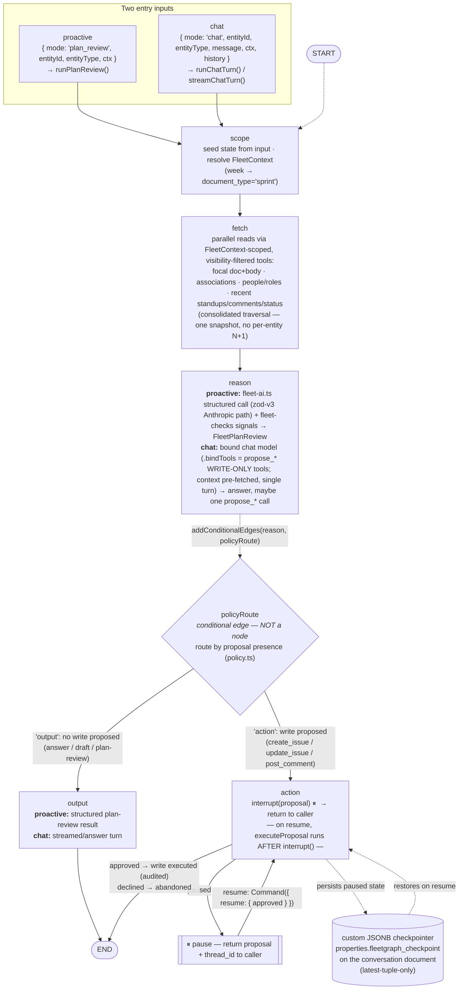

# FleetGraph — LangGraph Graph Shape

> **Living document.** Keep this in sync as Fleet entry points and nodes evolve — when a
> feature adds a trigger, node, or edge, update the diagram and notes here to match what shipped.

One compiled `StateGraph` serves **both** Fleet modes. The trigger differs; the graph does not.
Source: `api/src/services/fleetgraph/` (`graph.ts` assembles, `nodes/*` implement, `index.ts` exposes entry points).

## Flow



## ASCII (quick reference)

```
            ┌─ proactive: { mode:'plan_review', projectId }      (runPlanReview)
 trigger ───┤
            └─ chat: { mode:'chat', entityId, message, history }  (runChatTurn / streamChatTurn)
                  │
                  ▼
            scope        seed state · resolve FleetContext (week→sprint)
                  │
                  ▼
            fetch        parallel visibility-scoped reads → one merged context snapshot
                  │
                  ▼
            reason       proactive → fleet-ai structured (+ fleet-checks signals)
                  │      chat      → bound chat model (propose_* WRITE-ONLY; context pre-fetched)
                  ▼
            policyRoute ──────────┐   ← conditional edge (policy.ts), not a node
              │ (no write)        │ (write proposed)
              ▼                   ▼
            output            action ── interrupt(proposal) ──► [pause → caller]
              │                   ▲                                  │ resume Command({approved})
              ▼                   └──────── re-run from top ─────────┘
             END                 mutation executes AFTER interrupt(); pre-interrupt work idempotent
                                 approved → executeProposal (audited) ; declined → abandon → END
```

## Notes

- **One compiled graph, compiled once** (`graph.ts`), with the custom `ConversationDocCheckpointSaver` (`checkpointer.ts`) bound at compile time.
- **`thread_id` = conversation document id.** Proactive runs use a throwaway random UUID (matches no row → no persistence, single-shot, never pauses).
- **Two-tier provider strategy** (`reason`): proactive uses `fleet-ai.ts`'s structured path (preserves the tested zod-v3/v4 Anthropic workaround); chat uses LangChain `getBoundChatModel` (`model.ts`) with `.bindTools()`.
- **HITL invariant:** the action node calls `interrupt(proposal)` *before* the mutation; on resume (`resumeChatTurn` → `Command({ resume: { approved } })`) LangGraph re-runs only the interrupted node, so `executeProposal` runs exactly once with the confirmed args (parity backed by a content hash).
- **`policyRoute` is a conditional edge, not a node** (M-03 removed the former no-op `policy` node; the pure function stays in `policy.ts`, unit-tested). It routes on the resolved `proposal.kind`, not on model free-text — a proposed write → `action`, everything else → `output`.
- **Chat binds WRITE-ONLY tools.** `reason` (chat tier) calls `getBoundChatModel(createWriteTools(ctx))` — only `propose_create_issue` / `propose_update_issue` / `propose_post_comment`. The `fetch` node already assembled the full context into the prompt, so the model answers in a single turn with no read-tool round-trips.
- **Entry points** (`index.ts`): `runPlanReview` (proactive), `runChatTurn` / `streamChatTurn` (chat), `resumeChatTurn` (resume a paused proposal).
- **Chat trigger sources all seed the same `chat` input — the graph is unchanged by any of them:** the in-content launcher and the nav "Ask Fleet" button (empty `message`, user types), and the **drift badge hand-off** (`message` pre-seeded with the drift question and auto-sent as the first turn, via `FleetChatContext` `seedPrompt`).
- **Project drift _detection_ is deterministic and lives OUTSIDE this graph** — SQL aggregates (`driftSql.ts`) + the pure `computeProjectDrift` threshold function, surfaced as the drift badge. Only the on-demand *explanation* ("Ask Fleet about this drift") enters the graph, through the ordinary chat input. The badge detects; the graph reasons.
- `state.ts` defines the `Annotation` state + reducers (fetched snapshot = replace; messages = append).

_Living reference, originally generated from the U7 implementation — update it as the graph and its triggers change._
