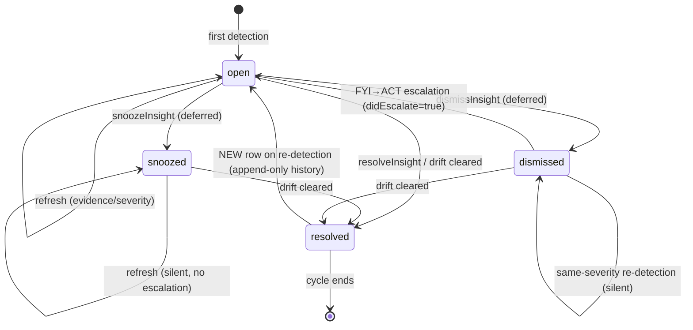

# feat: FleetGraph Insight Entity (data layer)

## Summary

Build the substrate for FleetGraph's proactive sweep: an `insight` document entity that records "a finding the agent decided to surface" for one `(subject, kind)` at a time, mirroring the `conversation` backing-store discipline. The entity is system-authored (`created_by = NULL`), hidden from generic document surfaces (already excluded in 6 places), associated to its subject via the existing `'discusses'` relationship, and stores all lifecycle state in JSONB `properties.*` keys via single-statement `jsonb_set`. This plan covers only the data layer: shared types, the partial unique index, the `insight.ts` service module, and unit + concurrency tests. The cron sweep, the graph `monitor` mode, the workspace settings toggle, the read endpoint, the UI/notification surface, and the owner-resolution helper are tracked as separate downstream plans.

---

## Problem Frame

Today FleetGraph runs only on-demand: every "proactive" finding (plan-quality review, drift) is computed on page-load. The PRD's MVP checklist requires *"a proactive detection wired end-to-end"* that *"runs without a user present,"* and the observability requirement is that *"different execution paths under different conditions"* — i.e. a true graph, not a pipeline. To satisfy that we need a headless sweep that fires the model, branches on its verdict, and writes findings somewhere durable. The insight entity is that "somewhere" — and getting its shape, lifecycle, and concurrency story right now means the sweep, notifications, and UI all build on a clean foundation. See `docs/fleetgraph/fleetgraph.md`, `docs/fleetgraph/presearch.md`, and `docs/fleetgraph/codex.md` for the broader FleetGraph context, and `docs/fleetgraph/observability.md` for how proactive findings tie into LangSmith tracing.

---

## Scope Boundaries

- The cron sweep itself (how/when proactive detection fires)
- The graph `monitor` mode and verdict prompt that produces insights
- Workspace-level enable/disable toggle for the sweep
- The read endpoint (`GET /api/fleetgraph/insights`)
- UI surface: notifications, insight list, badge integration
- Owner-resolution helper for SURFACE_ACT notifications
- `snoozeInsight` / `dismissInsight` write paths (no caller yet; the `snoozeUntil` field is reserved in the JSONB shape only)

### Deferred to Follow-Up Work

- Auto-resolve hook on subject delete/archive — v1 filters stale insights at read time; the delete-path hook is a follow-up
- A `ce-compound` capture for the hidden-system-authored-document pattern after this lands — `docs/solutions/` has zero coverage of it today
- Fixing the latent two-`pool.query` transaction bug in `api/src/services/fleetgraph/conversation.ts` (lines 96–111) — `createConversation` writes the doc + association in two separate pool calls, so if the association fails an orphan conversation row remains. Out of scope here but worth filing.

---

## Context & Research

### Relevant Code and Patterns

- `api/src/services/fleetgraph/conversation.ts` — the direct template. File-level JSDoc explains *why* (lines 1–29); INSERT shape (96–101); `appendTurn`'s single-statement `jsonb_set` with `COALESCE(... , '[]') || $turn` append (155–175); `claimPending`'s CTE + `SELECT FOR UPDATE` atomic-claim pattern (238–258). **Note:** `createConversation` (96–111) is *two* separate `pool.query` calls and is technically non-transactional — we will NOT replicate that shape; insight uses a single `PoolClient` with `BEGIN/COMMIT`.
- `api/src/services/issues-service.ts` (lines 166–242) — established `pg_advisory_xact_lock` + `PoolClient` transaction precedent for "serialize a multi-statement create-if-absent." Lock key derived as `parseInt(workspaceIdHex.substring(0, 15), 16)`. Insight upsert mirrors this.
- `api/src/middleware/visibility.ts` — `getVisibilityContext(userId, workspaceId)` returns `{ isAdmin }`; `VISIBILITY_FILTER_SQL(alias, userIdParam, isAdmin)` emits `(visibility='workspace' OR created_by = $userId OR isAdmin = TRUE)`. Insight reads apply this against the **subject's** visibility (not the insight's own column) so subject visibility changes don't leave a stale insight visible.
- `api/src/services/issue-dedup.ts` — scalar-subquery join precedent for "include subject title in the row shape to avoid caller N+1." `listOpenInsights` mirrors this style.
- `api/src/utils/document-crud.ts` (lines 200–232) — `INSERT INTO document_associations ... ON CONFLICT DO NOTHING` pattern for `discusses` association. Idempotent; safe for refresh path.
- `api/src/db/schema.sql:100` — `document_type` enum includes `'insight'`. `:155` — `created_by UUID REFERENCES users(id) ON DELETE SET NULL` (NULL allowed → system-authored). `:203` — `relationship_type` enum includes `'discusses'`.
- `api/src/routes/documents.ts:27,133,204,205,276,418` — six generic-surface exclusions of `'insight'`, already in place.
- `api/src/collaboration/index.ts:482–490` — Yjs collaboration room joins denied for `'insight'` (full `properties = $3` replace would wipe lifecycle state). Already in place; regression test at `api/src/collaboration/__tests__/collaboration.test.ts:459–475`.
- `shared/src/types/document.ts:34–44` — `DocumentType` union deliberately *excludes* `'conversation'` and `'insight'`. Do **not** add to it. Insight shared types go as a sibling block to `Drift` at lines 141–156.
- `api/src/services/fleet-service.test.ts` (lines 1–73) — mocked-pool unit-test style to mirror for the fast tests; `pool.query` mocked, SQL shape asserted, sequence-ordered with `mockResolvedValueOnce`.
- `api/vitest.config.ts:13–23` + `api/src/test/setup.ts:41–46` — real-Postgres test infrastructure: dedicated `ship_test` DB, `current_database()` name-guard, `TRUNCATE` at suite start, no per-test rollback. Concurrency tests in U6 use this path.

### Institutional Learnings

- `docs/solutions/test-failures/test-suite-truncates-shared-dev-database.md` — tests **must** point at `ship_test` via `vitest.config.ts` `test.env.DATABASE_URL`; the `current_database()` guard in `setup.ts` is the safety net. Apply when U6's concurrency tests need a real connection.
- `docs/solutions/logic-errors/fleet-chat-created-issue-not-associated-with-project.md` — a `documents` INSERT without its `document_associations` partner is an orphan that renders nowhere. Carry verbatim: documents INSERT + associations INSERT in **one transaction**, post-condition asserts both rows present.
- `docs/solutions/tooling-decisions/langsmith-two-tier-tracing-for-fleet.md` — keep `LANGSMITH_TRACING: 'false'` in `vitest.config.ts`; insight tests must not leak trace egress.
- No existing learning contradicts the settled design.

---

## Key Technical Decisions

1. **System-authored = `created_by = NULL`.** Schema already supports it. `INSERT INTO documents (... created_by, ...) VALUES (... NULL, ...)`. Documented in the file-level JSDoc.

2. **Visibility recomputed at read by joining the subject** — NOT snapshotted at create. Reads JOIN the subject document and apply `VISIBILITY_FILTER_SQL` against the subject's current visibility. Costs one join per read; prevents stale-visibility data leak if a subject flips from `workspace` to `private` after the insight is created. The insight's own `visibility` column is set to `'workspace'` at create time as a placeholder (cannot be `'private'` because `created_by = NULL` would make it admin-only via the existing filter, which is a footgun).

3. **Concurrency: two primitives, each where it fits.**
   - **`pg_advisory_xact_lock`** keyed on hashed `(workspace_id, subject_id, kind)` for the create-or-refresh upsert path (find-or-INSERT requires multi-statement serialization). Pattern from `issues-service.ts`.
   - **CTE + `SELECT ... FOR UPDATE`** for state transitions on a known row (`resolveInsight`). Pattern from `conversation.ts` `claimPending`.

4. **Defense-in-depth: partial unique index** on `(workspace_id, (properties->'fleetgraph_insight'->>'subject_id'), (properties->'fleetgraph_insight'->>'kind'))` `WHERE document_type = 'insight' AND properties->'fleetgraph_insight'->>'state' = 'open' AND archived_at IS NULL AND deleted_at IS NULL`. The service always takes the advisory lock; the index catches out-of-band writers (manual SQL, backfills, future code paths that forget the lock). Migration `046_fleetgraph_insight_open_index.sql`. (Nested-key form is authoritative — matches the Properties Layout in the High-Level Technical Design block and U2's migration spec.)

5. **State machine — append-only history.** A new detection against an existing `resolved` insight inserts a **fresh OPEN row**; old resolved row stays as historical record. The advisory lock protects "one OPEN per (subject, kind)" — not "one row ever." Multiple resolved-then-reopened cycles produce visible flap history.

6. **State machine — dismissed reopens on escalation only.** Same-severity re-detection against a `dismissed` insight: silent refresh (honor user intent). FYI→ACT escalation: flip status back to `open`, set `didEscalate = true`. Dismiss is a signal about the FYI tier, not the underlying condition forever.

7. **Two timestamps: `lastSeenAt` and `lastChangedAt`.** `lastSeenAt` advances on every observation (even when `inputHash` unchanged); `lastChangedAt` advances only when evidence changes. Single-statement `UPDATE ... SET last_seen_at = NOW(), occurrence_count = occurrence_count + 1` for the no-evidence-change refresh — server-side increment, no read-then-write.

8. **Transaction discipline: single `PoolClient` with `BEGIN/COMMIT`.** `documents` INSERT + `document_associations` INSERT in one transaction. `SET LOCAL statement_timeout = '5s'` at the top to bound stuck-lock blast radius. Subject `FOR SHARE` check inside the transaction asserts subject is not soft-deleted; on miss, ROLLBACK and return `didCreate = false` (benign race, not an error). Do **not** replicate `conversation.ts`'s two-`pool.query` non-transactional shape.

9. **`updated_at` is not bumped** by any insight write — mirrors `conversation.ts`'s "engine state, not a user edit" discipline. UI freshness comes from `lastSeenAt`.

10. **Title is descriptive**, e.g. `"Project drift: <project title>"` — not `"Untitled"`. The standard Untitled convention is for user-rendered docs that show TipTap placeholder styling; insight is never opened in the Editor (blocked by `collaboration/index.ts:488`). Safe deviation.

11. **`DocumentType` union stays untouched.** Insight shared types (`FleetInsight`, `InsightKind`, `InsightStatus`, `InsightSeverity`, `InsightVerdict`, `InsightProperties`) go as a new sibling block to `Drift` in `shared/src/types/document.ts`. Server-internal; the union is for client-facing kinds only.

12. **`snoozeUntil` reserved in the JSONB shape from day one** even though no v1 caller writes it. Avoids a schema-shape change when snooze ships. The sweep treats `snoozed` as OPEN-for-dedup (silent refresh, never escalate).

---

## High-Level Technical Design

*This illustrates the intended approach and is directional guidance for review, not implementation specification.*

### State machine



### `createOrRefreshInsight` decision matrix

| Existing row state | New severity | DB action | `didCreate` | `didEscalate` |
|---|---|---|---|---|
| (none) | any | INSERT doc + association | `true` | `false` |
| `open`, hash matches | same | bump `lastSeenAt` + `occurrenceCount` only | `false` | `false` |
| `open`, hash differs | same | refresh evidence/summary/recAction/verdict + bump both timestamps + count | `false` | `false` |
| `open`, FYI | ACT | refresh + set severity=ACT | `false` | **`true`** |
| `open`, ACT | FYI | refresh + set severity=FYI (silent de-escalation) | `false` | `false` |
| `resolved`, any | any | INSERT new doc + association (fresh OPEN row) | `true` | `false` |
| `snoozed`, any | any | silent refresh; keep `state='snoozed'` | `false` | `false` |
| `dismissed`, FYI | FYI | silent refresh; keep `state='dismissed'` | `false` | `false` |
| `dismissed`, ACT (was FYI) | ACT | flip to `state='open'` + refresh + severity=ACT | `false` | **`true`** |

### Properties layout (single nested key)

All lifecycle state lives under one top-level key, `properties.fleetgraph_insight`, with sub-fields updated via deep-path `jsonb_set('{fleetgraph_insight,<field>}', ...)`. Insight has a single writer per `(subject, kind)` serialized by the advisory lock, so the literal disjoint-per-field-key shape from `conversation.ts` (which exists because three different writers can interleave) is unnecessary. Each write is still a single statement and never read-modify-writes the full `properties` blob.

```
properties.fleetgraph_insight = {
  state:                'open' | 'resolved' | 'snoozed' | 'dismissed',
  kind:                 'project_drift',
  severity:             'fyi' | 'act',
  subject_id:           uuid,
  subject_entity_type:  'project' | 'issue' | ...,
  summary:              string,
  recommended_action:   string,
  evidence:             object,             // DriftSignal[] + facts
  verdict:              { decision, reasoning },
  input_hash:           string,
  accountable_owner_id: uuid | null,
  first_seen_at:        ISO8601,
  last_seen_at:         ISO8601,
  last_changed_at:      ISO8601,
  occurrence_count:     int,
  resolved_at:          ISO8601 | null,
  resolved_reason:      string | null,
  snoozed_until:        ISO8601 | null,     // reserved; no v1 writer
  dismissed_at:         ISO8601 | null,
  dismissed_by:         uuid | null,
}
```

---

## Implementation Units

### U1. Shared insight types

**Goal:** Add the shared TypeScript types that describe an insight, alongside `Drift` in `shared/src/types/document.ts`. These are server-internal but live in `shared` so the future read endpoint and UI consume the same shape.

**Requirements:** Decisions 11 (union untouched), 7 (`lastSeenAt` + `lastChangedAt`), 12 (`snoozeUntil` reserved).

**Dependencies:** none.

**Files:**
- `shared/src/types/document.ts` — modify; add new block adjacent to `Drift` (around line 156).

**Approach:**
- Add `InsightKind` (`'project_drift'`), `InsightStatus` (`'open' | 'resolved' | 'snoozed' | 'dismissed'`), `InsightSeverity` (`'fyi' | 'act'`), `InsightVerdictDecision` (`'SUPPRESS' | 'SURFACE_FYI' | 'SURFACE_ACT'`) as `type` aliases.
- Add `InsightVerdict`, `InsightProperties`, and `FleetInsight` as `interface`s. `FleetInsight` is the read shape returned by `getInsight` / `listOpenInsights` (id, workspace_id, title, subject_id, subject_entity_type, subject_title — joined — and the unpacked properties).
- Multi-line `//` header explaining: "Insight state — system-authored backing store for FleetGraph proactive findings. Persisted as `document_type='insight'` documents; lifecycle in `properties.fleetgraph_insight`. Visibility evaluated against the SUBJECT at read time, not stored on the insight itself."
- Do **not** add `'insight'` to the `DocumentType` union (line 34) or to any `DocumentProperties` union — server-internal.

**Patterns to follow:** `Drift` / `DriftSignal` block (lines 141–156). PascalCase interfaces, type aliases for literal unions, snake_case for stored literal values matching the JSONB keys.

**Test scenarios:** none — pure type declarations, exercised by U3–U5 tests at the type level.

**Verification:** `pnpm build:shared` succeeds; `pnpm type-check` clean across the monorepo.

---

### U2. Defense-in-depth partial unique index

**Goal:** Add migration `046_fleetgraph_insight_open_index.sql` creating a partial unique index that enforces "one OPEN insight per `(workspace_id, subject_id, kind)`" at the database level.

**Requirements:** Decision 4.

**Dependencies:** U1 not strictly required (no shared-types import in SQL), but conceptually the schema lands first.

**Files:**
- `api/src/db/migrations/046_fleetgraph_insight_open_index.sql` — new.

**Approach:**
- Single `CREATE UNIQUE INDEX IF NOT EXISTS` statement on `documents` keyed on `(workspace_id, (properties->'fleetgraph_insight'->>'subject_id'), (properties->'fleetgraph_insight'->>'kind'))` with `WHERE document_type = 'insight' AND properties->'fleetgraph_insight'->>'state' = 'open' AND archived_at IS NULL AND deleted_at IS NULL`.
- Migration header comment explains: "Defense-in-depth invariant. The `insight.ts` service serializes upserts via `pg_advisory_xact_lock`; this index catches out-of-band writers (manual SQL, future code paths that forget the lock). Service paths never expect to hit this conflict — a 23505 from this index is a contract violation worth alerting on."
- No data backfill needed — no existing insight rows.
- Runs in the per-migration `BEGIN/COMMIT` automatically (mirrors migration 045's style).

**Patterns to follow:** Style of `045_fleetgraph_document_types.sql` (header comment explaining intent; idempotent shape).

**Test scenarios:**
- AppLies cleanly to a fresh database (`pnpm db:migrate`).
- Applies cleanly when re-run (idempotent `IF NOT EXISTS`).
- Confirmed via U6's concurrency test that two concurrent un-locked INSERTs of the same `(subject, kind)` produce exactly one row (the second errors with 23505) — proving the index is the floor when the lock is bypassed.

**Verification:** `pnpm db:migrate` runs to completion; `psql ship_dev -c "\d+ documents"` shows the new index; re-running `pnpm db:migrate` is a no-op.

---

### U3. `createOrRefreshInsight` — upsert + escalation

**Goal:** Implement the workhorse function: take an advisory lock, find-or-INSERT the OPEN insight, apply the decision-matrix logic, return `{ insight, didCreate, didEscalate }`. This is the largest unit and carries the transaction discipline.

**Requirements:** Decisions 1, 3, 5, 6, 7, 8, 9, 10, 12. Settled state machine in High-Level Technical Design.

**Dependencies:** U1 (types), U2 (index — service paths never expect to hit it but tests rely on it being present).

**Files:**
- `api/src/services/fleetgraph/insight.ts` — new. File-level JSDoc preamble mirroring `conversation.ts:1–29`, explaining: system-authored discipline, identity invariant + lock, properties layout, visibility model (recomputed at read), transaction shape, `lastSeenAt`/`lastChangedAt` split, escalation contract.
- `api/src/services/fleetgraph/insight.test.ts` — new. Mocked-pool style mirroring `fleet-service.test.ts`.

**Approach:**
- Signature: `createOrRefreshInsight(args: CreateOrRefreshArgs): Promise<{ insight: FleetInsight; didCreate: boolean; didEscalate: boolean }>`. Args carry `workspaceId`, `subjectId`, `subjectEntityType`, `kind`, `severity`, `summary`, `recommendedAction`, `evidence`, `verdict`, `inputHash`, `accountableOwnerId?`.
- Acquire a `PoolClient` via `pool.connect()`; `BEGIN`; `SET LOCAL statement_timeout = '5s'`; `SELECT pg_advisory_xact_lock(<key>)` keyed on a hash of `(workspaceId, subjectId, kind)` (use `hashtext(workspaceId || subjectId || kind)::bigint` or the existing hex-to-bigint convention from `issues-service.ts`).
- Inside the lock: `SELECT ... FROM documents WHERE document_type='insight' AND workspace_id=$1 AND properties->'fleetgraph_insight'->>'subject_id' = $2 AND properties->'fleetgraph_insight'->>'kind' = $3 AND properties->'fleetgraph_insight'->>'state' IN ('open','snoozed','dismissed') AND archived_at IS NULL AND deleted_at IS NULL ORDER BY created_at DESC LIMIT 1`.
- Decision matrix branches:
  - **No row:** validate subject exists (`SELECT 1 FROM documents WHERE id = $subjectId AND deleted_at IS NULL FOR SHARE`); on miss, `ROLLBACK` and return `{ insight: null, didCreate: false, didEscalate: false }` (per Decision 8 — benign race). On hit, INSERT documents row (`created_by=NULL`, `visibility='workspace'`, descriptive title, properties JSONB built from args), then INSERT `document_associations (insightId, subjectId, 'discusses') ON CONFLICT DO NOTHING`. `COMMIT`. Return `didCreate=true`.
  - **Row found, `state='resolved'`** — *unreachable by this query (filtered out)*; resolved rows go through the no-row path because the `state IN ('open','snoozed','dismissed')` filter excludes them. New OPEN row inserted; old resolved row stays.
  - **`state='open'`, hash matches:** single-statement `UPDATE ... SET properties = jsonb_set(jsonb_set(properties, '{fleetgraph_insight,last_seen_at}', to_jsonb(NOW())), '{fleetgraph_insight,occurrence_count}', to_jsonb((properties->'fleetgraph_insight'->>'occurrence_count')::int + 1))`. `COMMIT`.
  - **`state='open'`, hash differs:** UPDATE refreshes evidence/summary/recommended_action/verdict/input_hash + bumps both timestamps + count. Compare old severity to new; set `didEscalate=true` iff old=FYI and new=ACT. `COMMIT`.
  - **`state='snoozed'`:** silent refresh — same UPDATE shape as open+hash-differs, but `didEscalate` stays false regardless of severity transition (snooze suppresses escalation pings — Decision 12).
  - **`state='dismissed'`, same or lower severity:** silent refresh (`lastSeenAt`, occurrence_count, evidence) — keep `state='dismissed'`. `didEscalate=false`.
  - **`state='dismissed'`, FYI→ACT:** UPDATE flips `state='open'`, sets severity=ACT, refreshes fields, `didEscalate=true` (Decision 6).
- After COMMIT, SELECT and map to `FleetInsight` for return (the function returns the post-write state).
- On any thrown error inside the transaction: client.query('ROLLBACK'), rethrow. Always `client.release()` in finally.

**Patterns to follow:**
- Transaction shape: `api/src/services/issues-service.ts:166–242`.
- Disjoint-key `jsonb_set` discipline: `api/src/services/fleetgraph/conversation.ts:155–175`.
- File-level JSDoc preamble: `conversation.ts:1–29`.

**Execution note:** Implement test-first for the decision matrix — each row of the matrix in High-Level Technical Design is one test case (T1–T9 below). Get the matrix table green before adding error/race tests.

**Test scenarios** (mocked-pool unit tests in `insight.test.ts`):

*Decision matrix:*
- T1. First detection (no existing row): SQL sequence is BEGIN → statement_timeout → advisory_lock → SELECT (returns empty) → SELECT subject FOR SHARE (exists) → INSERT documents → INSERT document_associations → COMMIT. Returns `didCreate=true`, `didEscalate=false`. Assert: `created_by` parameter is `null`; `visibility` parameter is `'workspace'`; title parameter starts with `"Project drift:"`; properties JSON parameter has `state='open'`, `severity='fyi'` (when caller passes fyi), correct `subject_id`/`kind`/`input_hash`.
- T2. Re-detection, same input_hash: SQL sequence is lock → SELECT (returns open row) → UPDATE setting only `last_seen_at` + `occurrence_count` (no evidence/severity columns touched). Returns `didCreate=false`, `didEscalate=false`. Assert `last_changed_at` NOT in the UPDATE.
- T3. Re-detection, different input_hash, same severity: UPDATE refreshes evidence + summary + recommended_action + verdict + bumps both timestamps + count. `didEscalate=false`.
- T4. FYI→ACT escalation: UPDATE refreshes including `severity='act'`. Returns `didEscalate=true`.
- T5. ACT→FYI de-escalation: UPDATE refreshes including `severity='fyi'`. Returns `didEscalate=false`.
- T6. Prior `resolved` row + new detection: existing-row SELECT returns empty (resolved filtered out by `state IN (open,snoozed,dismissed)`); falls into the no-row branch → fresh INSERT. Assert exactly one INSERT documents call.
- T7. Prior `dismissed` row + same-severity re-detection: silent refresh, `state` stays dismissed, `didEscalate=false`.
- T8. Prior `dismissed` row + FYI→ACT escalation: UPDATE flips `state='open'` AND severity=ACT, `didEscalate=true`.
- T9. Prior `snoozed` row: silent refresh, `state` stays snoozed, `didEscalate=false` even if severity transitions FYI→ACT (snooze suppresses pings).

*Transaction discipline:*
- T10. Subject deleted between sweep decision and create call: SELECT subject FOR SHARE returns empty → ROLLBACK → returns `{insight:null, didCreate:false}`. Assert no INSERT calls.
- T11. INSERT documents succeeds, INSERT document_associations rejected: ROLLBACK fires; no orphan documents row visible after. Asserted via mock: COMMIT not called.
- T12. Mid-transaction error (mock throws): client.query('ROLLBACK') fires, client.release() fires, error rethrown.
- T13. `statement_timeout` is set before the advisory lock acquisition (assert order in the SQL sequence).
- T14. `created_by` is bound as SQL `NULL`, not the string `'null'` (regression for system-authored).

*Decision-matrix invariants:*
- T15. `didCreate` is `true` exactly when a documents INSERT fires; `false` on every refresh branch.
- T16. `didEscalate` is `true` only when old severity was `'fyi'` and new is `'act'` (cases T4, T8); `false` everywhere else.

**Verification:** `pnpm --filter @ship/api test insight.test.ts` green for all 16 scenarios; `pnpm type-check` clean.

---

### U4. `resolveInsight` — idempotent state transition

**Goal:** Implement a CTE + `SELECT FOR UPDATE` resolver that flips `state` to `'resolved'` and stamps `resolved_at` / `resolved_reason`. Idempotent (already-resolved is a no-op, doesn't throw). Targets any non-`resolved` status — auto-resolve from a cleared drift condition can flip an `open`, `snoozed`, or `dismissed` row to `resolved`.

**Requirements:** Decision 3 (CTE+FOR UPDATE for state transitions), settled state machine.

**Dependencies:** U1 (types), U3 (test fixtures share helpers).

**Files:**
- `api/src/services/fleetgraph/insight.ts` — extend; add `resolveInsight(insightId, opts?: { reason?: string; expectedState?: InsightStatus })`.
- `api/src/services/fleetgraph/insight.test.ts` — extend with `describe('resolveInsight', ...)`.

**Approach:**
- Single statement: CTE selects-and-locks the row by id with `FOR UPDATE`, captures old state; UPDATE sets `state='resolved'`, stamps `resolved_at`, optionally `resolved_reason`; UPDATE only fires when `state != 'resolved'` (idempotency built in). RETURNING the captured old state so caller can tell whether it was a no-op.
- If `opts.expectedState` provided, RAISE / throw on mismatch (lets the user-initiated resolve route fail loudly on race; auto-resolve omits it).
- Does NOT bump `updated_at` (engine state).
- Mirrors `conversation.ts:238–258` shape.

**Patterns to follow:** `conversation.ts:claimPending` (238–258).

**Test scenarios:**
- T17. Resolve `open` → state=resolved, resolved_at stamped, returns prior state.
- T18. Resolve `resolved` → no-op, returns prior state, no DB write of `resolved_at` (preserves original).
- T19. Resolve `dismissed` → state=resolved (auto-resolve path can target dismissed per state-machine).
- T20. Resolve `snoozed` → state=resolved.
- T21. Resolve with `expectedState: 'open'` against an `open` row → succeeds.
- T22. Resolve with `expectedState: 'open'` against a `resolved` row → throws (race-detection contract).
- T23. Resolve a nonexistent id → returns null / does not throw.
- T24. Asserted: SQL uses `FOR UPDATE` lock and single-statement CTE shape.

**Verification:** `pnpm --filter @ship/api test insight.test.ts` green; type-check clean.

---

### U5. `listOpenInsights` + `getInsight` — read paths with subject join

**Goal:** Implement visibility-correct reads. Both reads JOIN the subject document and apply `VISIBILITY_FILTER_SQL` against the subject's current visibility. `listOpenInsights` returns ordered, visibility-scoped open insights for a workspace; `getInsight` returns one by id.

**Requirements:** Decisions 2 (visibility recompute at read), 11. Includes subject join for `subject_title` + `subject_document_type` (avoids caller N+1).

**Dependencies:** U1 (types), U3 (data to read).

**Files:**
- `api/src/services/fleetgraph/insight.ts` — extend.
- `api/src/services/fleetgraph/insight.test.ts` — extend with `describe('listOpenInsights', ...)` and `describe('getInsight', ...)`.

**Approach:**
- `listOpenInsights(ctx: { workspaceId, userId, isAdmin, subjectIds?, kinds?, limit?, offset? })`: SELECT `i.id`, `i.title`, `i.properties->'fleetgraph_insight'`, `s.id AS subject_id`, `s.title AS subject_title`, `s.document_type AS subject_document_type` FROM `documents i` INNER JOIN `document_associations da ON da.document_id = i.id AND da.relationship_type = 'discusses'` INNER JOIN `documents s ON s.id = da.related_id AND s.workspace_id = i.workspace_id` WHERE `i.workspace_id = $workspace` AND `i.document_type = 'insight'` AND `i.archived_at IS NULL AND i.deleted_at IS NULL` AND `i.properties->'fleetgraph_insight'->>'state' = 'open'` AND `s.deleted_at IS NULL AND s.archived_at IS NULL` AND `${VISIBILITY_FILTER_SQL('s', '$userId', isAdmin)}` AND (optional subjectIds filter) AND (optional kinds filter) ORDER BY `(properties->'fleetgraph_insight'->>'severity' = 'act') DESC, (properties->'fleetgraph_insight'->>'last_seen_at') DESC, i.id DESC` LIMIT/OFFSET. The `s.workspace_id = i.workspace_id` join predicate prevents a malformed cross-workspace `discusses` association from evaluating subject-visibility against a workspace the user is not a member of. `getInsight` applies the same same-workspace constraint.
- Visibility filter applies to the **subject** alias `s`, NOT the insight `i` — this is the security-relevant part (Decision 2).
- `getInsight(insightId, ctx)`: same shape, single-row return, returns null on no match.
- Note `created_by = NULL` does not show up favorably in the subject filter (which considers `s.created_by`), but that's correct: a subject created by user X has `s.created_by = X`, so users who created the subject or are admins or where subject is workspace-visible all see the insight via the same filter rule.

**Patterns to follow:**
- `api/src/services/issue-dedup.ts` — scalar-subquery vs JOIN balance; subject-title fetch precedent.
- `api/src/middleware/visibility.ts` — `VISIBILITY_FILTER_SQL` is called with resolved boolean (Decision uses shape (2)).

**Test scenarios:**
- T25. Non-admin sees workspace-visible-subject insights.
- T26. Non-admin does NOT see insights on private subjects they didn't create.
- T27. Non-admin sees insights on private subjects they DID create (filter ORs against `s.created_by = $userId`).
- T28. Admin sees all insights.
- T29. Insights on soft-deleted subjects (`s.deleted_at IS NOT NULL`) are excluded.
- T30. Insights on archived subjects are excluded.
- T31. `state='resolved'` insights are excluded.
- T32. Ordering: ACT before FYI; within tier, `last_seen_at DESC`; final tiebreaker `id DESC` deterministic.
- T33. `subject_title` and `subject_document_type` are populated in returned rows (no N+1).
- T34. `getInsight(invisibleId)` returns null (404-shaped, not 403; prevents disclosure).
- T35. `getInsight(nonexistentId)` returns null.
- T36. `getInsight(visibleId)` returns the insight with subject metadata.

**Verification:** `pnpm --filter @ship/api test insight.test.ts` green for all read scenarios; `pnpm type-check` clean.

---

### U6. Concurrency integration tests (real Postgres)

**Goal:** Prove the load-bearing concurrency claims with real `pg` connections — not mocks. These tests are what catch the bugs the mocked tests can't see.

**Requirements:** Decision 3 (advisory lock + CTE+FOR UPDATE actually serialize), Decision 4 (partial unique index is the floor).

**Dependencies:** U1–U5 implemented; migration 046 applied to `ship_test`.

**Files:**
- `api/src/services/fleetgraph/insight.concurrency.test.ts` — new. Real-pg integration tests; separate file so the fast mocked suite doesn't drag.

**Approach:**
- Uses the `ship_test` DB via existing vitest infrastructure (`api/vitest.config.ts:13–23` + `api/src/test/setup.ts`).
- Per-test fixture: create a fresh workspace + a fresh project document inline (matching `documents-visibility.test.ts:30–77` precedent). Unique `testRunId` suffix per test for collision-free naming.
- Each test calls `createOrRefreshInsight` (or `resolveInsight`) from multiple real pool connections concurrently via `Promise.all`.
- Tests must NOT mock the pg pool — they exercise the actual advisory lock semantics.

**Test scenarios:**
- T37 (R1). Two parallel `createOrRefreshInsight` first-detections on same (subject, kind): exactly one OPEN row, exactly one `discusses` association; second call's `didCreate=false` because it took the refresh path.
- T38 (R2). Two parallel refreshes with *different* `inputHash` on the same row: final `occurrence_count` = `start+2` (server-side increment correctness, no torn count).
- T39 (R3). Two parallel `resolveInsight` calls: both succeed, single row in `resolved` state.
- T40 (R4). Parallel `createOrRefreshInsight` + `resolveInsight` on the same row: deterministic final state (open row inserted fresh post-resolve, OR refresh observed open → see Decision 5: resolved+new = fresh new row, so final is one resolved + one open).
- T41 (G4 / index floor). Bypass the lock: two direct INSERTs of the same `(workspace, subject, kind)` open-shaped document. Second errors with `23505` from the partial unique index. Proves the index catches out-of-band writers.
- T42 (R7). Force an associations-INSERT failure (e.g., pre-insert a conflicting association row to trigger the unique constraint): documents INSERT rolls back, no orphan row remains. *Implementation note: requires an association conflict the service doesn't catch; if `ON CONFLICT DO NOTHING` swallows it, simulate by tearing the documents FK instead.*
- T43 (G11). Different `kind`s coexist OPEN on same subject (lock keys differ → no contention).
- T44 (statement_timeout). Run a long-blocking operation in another connection that holds a row lock the upsert needs; assert the locked transaction times out at 5s and rolls back, releasing the lock.

**Verification:** `pnpm --filter @ship/api test insight.concurrency.test.ts` green; `pnpm test` clean overall; concurrency tests measurably exercise parallelism (assert via timing or by inspecting Promise.all behavior).

---

## Risks

- **Conversation.ts's latent two-`pool.query` bug.** The named "discipline to mirror" has a transactional gap in `createConversation`. The risk is that a future contributor reads `conversation.ts` for a pattern and copies the non-transactional shape into `insight.ts` (or vice versa). Mitigation: file-level JSDoc preamble in `insight.ts` calls this out explicitly ("Mirror conversation.ts's `jsonb_set` discipline and `claimPending` shape — but NOT `createConversation`'s two-`pool.query` write; insight uses a single `PoolClient` BEGIN/COMMIT."). The conversation fix is filed as a follow-up.
- **JSONB partial unique index performance.** The proposed index keys on JSONB text extracts. Postgres supports this, and at insight volumes (one row per surfaced finding per workspace) it's tiny. Risk: at very large scale the index isn't well-clustered. Mitigation: if scaling becomes an issue, lift `subject_id` / `kind` / `state` into real columns. Not v1's problem.
- **Visibility filter complexity at read time.** Joining the subject and applying the visibility filter on the subject's `created_by` / `visibility` is correct but couples insight reads to subject-table schema. Risk: future subject-visibility changes (e.g., a per-document ACL) would require updating this query. Mitigation: keep the filter expression localized to one helper.
- **Lock-key collisions.** `pg_advisory_xact_lock` takes a 64-bit key. Hashing `(workspace, subject, kind)` to 64 bits has tiny but non-zero collision probability. Risk: two unrelated `(subject, kind)` tuples serialize unnecessarily. Mitigation: hash quality is `hashtext` (Postgres built-in); collisions are throughput-only, not correctness — wrong tuples still take the no-row branch correctly.
- **`statement_timeout = 5s` is a guess.** Picked to bound stuck transactions; the actual upper bound on healthy upserts is single-digit ms. Risk: 5s is generous enough to mask a real deadlock for that long. Mitigation: log every timeout event; tune down if stable.

---

## Verification

- `pnpm build:shared && pnpm type-check` clean (U1 types compose with U3–U5 service consumers).
- `pnpm db:migrate` applies migration 046 idempotently; second run is a no-op.
- `pnpm --filter @ship/api test insight.test.ts` — all decision-matrix, transaction-discipline, and visibility scenarios green (T1–T36).
- `pnpm --filter @ship/api test insight.concurrency.test.ts` — all concurrency invariants green against real `ship_test` Postgres (T37–T44).
- `pnpm test` clean for the whole api package (no regressions in `collaboration.test.ts:459–475` insight fixture, no regressions in `conversation.test.ts`).
- Manual smoke (optional): in `psql ship_dev`, `INSERT INTO documents (workspace_id, document_type, title, created_by, visibility, properties) VALUES ('<existing-ws>', 'insight', 'Smoke', NULL, 'workspace', '{"fleetgraph_insight":{"state":"open","kind":"project_drift","subject_id":"<existing-project>"}}'::jsonb)` succeeds; retry should violate the partial unique index (`23505`).
