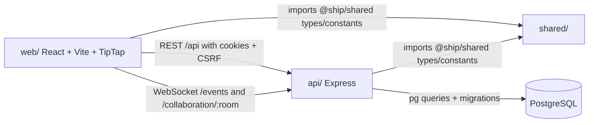
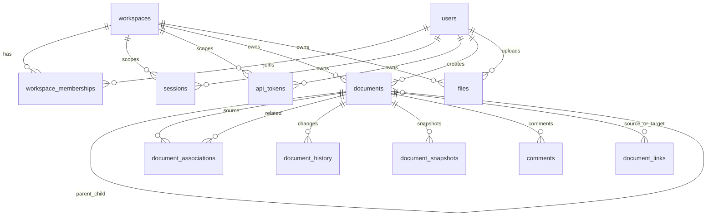

# Phase 1: First Contact

## 1. Repository Overview

Question line items:

- Clone the repo and get it running locally. Document every step, including anything that was not in the README.
- Read every file in the docs/ folder. Summarize the key architectural decisions in your own words.
- Read the shared/ package. What types are defined? How are they used across the frontend and backend?
- Create a diagram of how the web/, api/, and shared/ packages relate to each other.

### Local setup

README.md Setup instructions were sufficient to get the repo running locally.

### Docs summary

The docs describe Ship as a deliberately simple monorepo product built around one core idea: most product entities are documents. The architecture favors boring infrastructure, direct SQL, manual migrations, and explicit server ownership of shared state over heavy frameworks or early abstraction.

Key architectural decisions:

- Monorepo layout: `web/`, `api/`, and `shared/` are separate workspace packages managed with pnpm.
- Server is the source of truth: clients may cache and edit optimistically, but PostgreSQL and the API own durable state.
- Unified document model: docs, issues, programs, projects, weeks/sprints, people, plans, retros, standups, and reviews are all rows in `documents` with a `document_type` discriminator and JSONB `properties`.
- Authorization is workspace-centered: `users` are global, `workspace_memberships` grant access, and `person` documents are product content rather than authorization records.
- Collaboration is hybrid: REST handles metadata and workflow operations; WebSocket/Yjs handles rich editor content and live collaboration.
- Direct SQL is preferred: the API uses `pg` and SQL helpers rather than an ORM.
- Deployment is intentionally straightforward: Docker images for the API, static web assets for the frontend, Elastic Beanstalk/CloudFront/S3/Aurora in Terraform, and manual deploy scripts.
- The docs are partially stale in terminology. Some older docs still mention direct `program_id`, `project_id`, or `sprint_id` columns and older sprint-plan document types. The current schema uses `document_associations` and document types such as `weekly_plan` and `weekly_retro`.

### Shared package

The `shared/` package exports cross-package types and constants from `@ship/shared`.

Main exported types:

- API envelope types: `ApiResponse<T = unknown>` and `ApiError`.
- User/workspace types: `User`, `Workspace`, `WorkspaceMembership`, `WorkspaceInvite`, `AuditLog`, `WorkspaceWithRole`, and `MemberWithUser`.
- Document taxonomy: `DocumentType`, `DocumentVisibility`, `BelongsToType`, `BelongsTo`, and `CascadeWarning`.
- Document property types: `IssueProperties`, `ProgramProperties`, `ProjectProperties`, `WeekProperties`, `PersonProperties`, `WikiProperties`, `WeeklyPlanProperties`, `WeeklyRetroProperties`, `StandupProperties`, and `WeeklyReviewProperties`.
- Typed document shapes: `Document`, `WikiDocument`, `IssueDocument`, `ProgramDocument`, `ProjectDocument`, `SprintDocument`, `PersonDocument`, `WeeklyPlanDocument`, `WeeklyRetroDocument`, `StandupDocument`, and `WeeklyReviewDocument`.
- Shared constants: HTTP status values, error-code strings, and session timeout constants.

How they are used:

- `api/` imports shared document/workspace types so route handlers, service functions, and response shapes line up with the frontend.
- `web/` imports the same types for React hooks, API clients, editor components, and state models.
- `shared/` is a compile-time contract. Runtime validation still happens separately, mostly with Zod schemas in API routes.

### Package relationship diagram

## 2. Data Model

Question line items:

- Find the database schema (migrations or seed files). Map out the tables and their relationships.
- Understand the unified document model: how does one table serve docs, issues, projects, and sprints?
- What is the `document_type` discriminator? How is it used in queries?
- How does the application handle document relationships (linking, parent-child, project membership)?

### Schema location

The canonical schema is in `api/src/db/schema.sql`. Migrations live under `api/src/db/migrations/`, and seeds/test setup live under `api/src/db/seed.ts` and `api/src/test/setup.ts`.

### Tables and relationships

Core tables:

- `workspaces`, `users`, `workspace_memberships`, `workspace_invites`, `audit_logs`, `sessions`, and `oauth_state` handle identity, workspace access, auditability, and auth.
- `documents` is the central product table.
- `document_associations` stores document-to-document relationships such as program, project, sprint/week, and parent links.
- `document_history` and `document_snapshots` store change history and point-in-time document state.
- `sprint_iterations` and `issue_iterations` capture review/iteration workflows.
- `files`, `document_links`, and `comments` attach supporting content to documents.
- `api_tokens` supports token-based API access.

### Unified document model

`documents` is the common table for product objects. A row has common columns such as `workspace_id`, `title`, `content`, `yjs_state`, `parent_id`, `position`, `ticket_number`, archive/delete timestamps, conversion fields, creator, visibility, and timestamps. Type-specific workflow fields live in `properties JSONB`.

That lets one table serve multiple product concepts:

- Wiki docs use `document_type = 'wiki'`.
- Issues use `document_type = 'issue'`, a ticket number, issue status fields, and issue-specific JSONB properties.
- Programs/projects use `document_type = 'program'` or `document_type = 'project'` with planning and ownership metadata in properties.
- Weeks/sprints use `document_type = 'sprint'`; the product language is "week", but the schema still uses the historical `sprint` type internally.
- People, weekly plans, retros, standups, and reviews are also typed documents.

This model makes the editor, linking, visibility, history, and relationship logic reusable across entity types. The tradeoff is that the database cannot fully enforce every type-specific property shape.

### `document_type` discriminator

`document_type` is a PostgreSQL enum and a TypeScript union. It is used to:

- Filter lists, for example issue routes query `documents WHERE document_type = 'issue'`.
- Choose route behavior and response shaping.
- Drive frontend rendering and tabs, such as document editors, issue views, project views, and week views.
- Narrow TypeScript types in shared document models.
- Decide which properties are meaningful for a row.

### Document relationships

The app uses several relationship mechanisms:

- `documents.parent_id`: direct self-reference for containment and sidebar/document hierarchy, with a trigger to prevent circular parent chains.
- `document_associations`: flexible document-to-document membership with `relationship_type` values including `parent`, `project`, `sprint`, and `program`.
- `belongs_to`: the API/frontend representation of associations, typically built from `document_associations`.
- `document_links`: explicit links between documents, including link type and optional context.
- Conversion fields: `converted_to_id` and `converted_from_id` preserve relationships when one document changes type.

The docs recommend using `api/src/utils/document-crud.ts` helpers for association handling so route code does not drift into ad hoc SQL.

## 3. Request Flow

Question line items:

- Pick one user action (e.g., creating an issue) and trace it from the React component through the API route to the database query and back.
- Identify the middleware chain: what runs before every API request?
- How does authentication work? What happens to an unauthenticated request?

### Example action: creating an issue

Flow from UI to database:

1. The user clicks create issue in the React UI. `web/src/pages/App.tsx` exposes `handleCreateIssue`, and `web/src/pages/Issues.tsx` passes issue creation through the issue list UI.
2. `web/src/components/issues/IssuesList.tsx` calls `createIssueMutation.mutateAsync(...)` or the page-level create handler, then navigates to the new issue document.
3. `web/src/hooks/useIssuesQuery.ts` calls `createIssueApi`, which posts to `/api/issues`. The hook performs an optimistic update with a temporary issue, replaces it on success, and invalidates issue list queries.
4. `web/src/lib/api.ts` wraps the request. For state-changing requests it fetches `/api/csrf-token` if needed, sends `X-CSRF-Token`, includes credentials, and retries once on CSRF expiry.
5. `api/src/routes/issues.ts` handles `POST /api/issues` behind `authMiddleware`. The route validates input with Zod.
6. The route opens a PostgreSQL transaction, takes a workspace advisory lock for ticket-number allocation, computes `MAX(ticket_number) + 1`, inserts a `documents` row with `document_type = 'issue'`, and inserts any `document_associations` for `belongs_to`.
7. The transaction commits, accountability updates may be broadcast, and the API returns `201` with the new issue shape.
8. The frontend swaps the optimistic issue for the persisted issue and navigates to `/documents/:id`.

### API middleware chain

The Express app in `api/src/app.ts` sets up this chain:

- Production trust-proxy handling and CloudFront forwarded-proto normalization.
- `helmet` security headers and CSP/HSTS configuration.
- `/api/` rate limiting.
- CORS with configured origin and credentials enabled.
- JSON and URL-encoded body parsing.
- Signed cookie parsing and Express session setup.
- Public `/api/csrf-token`, `/health`, and Swagger routes.
- Conditional CSRF protection: Bearer token requests skip CSRF; browser state-changing routes require it.
- Public feedback route before protected route groups.
- Stricter auth/login rate limiting.
- Route groups, usually with route-level `authMiddleware`.

WebSocket auth is separate in `api/src/collaboration/index.ts` during HTTP upgrade handling.

### Authentication behavior

`authMiddleware` checks authentication in this order:

1. Bearer API token. The token is hashed, looked up in `api_tokens`, checked for revocation/expiry, and tied to a user/workspace.
2. Signed `session_id` cookie. The session row is checked for existence, expiry, absolute timeout, inactivity timeout, and workspace membership.

On success, the middleware attaches fields such as `userId`, `workspaceId`, `sessionId`, `isSuperAdmin`, and `isApiToken` to the request.

Unauthenticated requests receive `401` JSON errors. Expired sessions return a `SESSION_EXPIRED` style response. Revoked or missing workspace membership returns `403`. The frontend only redirects automatically for explicit session-expired responses; generic unauthorized responses remain regular API errors.

# Phase 2: Deep Dive

## 4. Real-time Collaboration

Question line items:

- How does the WebSocket connection get established?
- How does Yjs sync document state between users?
- What happens when two users edit the same document at the same time?
- How does the server persist Yjs state?

### WebSocket establishment

The client editor in `web/src/components/Editor.tsx` creates a Yjs document for the current `documentId`, opens IndexedDB persistence with a key like `ship-${roomPrefix}-${documentId}`, and creates a `WebsocketProvider` pointed at the API collaboration endpoint. Room names include a prefix, for example `wiki:<id>` or `issue:<id>`.

The API attaches collaboration handling in `api/src/index.ts` by calling `setupCollaboration(server)`. Upgrade requests for `/events` and `/collaboration/*` are handled in `api/src/collaboration/index.ts`. During upgrade, the server validates the session cookie, workspace membership, visibility access, rate limits, and message-size limits before accepting the socket.

### Yjs sync behavior

The server keeps in-memory maps of active Yjs docs, awareness state, socket connections, event connections, and pending saves. When a client connects:

- The server loads an existing in-memory Y.Doc if available.
- If not, it loads `documents.yjs_state` from PostgreSQL.
- If no Yjs state exists, it converts stored JSON content into a Yjs document.
- It sends the initial Yjs sync step and awareness state.

After that, Yjs binary updates are broadcast to the other clients in the same room.

### Simultaneous edits

Yjs is a CRDT, so concurrent edits are merged rather than treated as last-write-wins text blobs. Two users can edit the same document at the same time; their local Yjs updates commute and converge into the same shared document state. Awareness messages handle cursor/presence data separately from document content.

### Persistence

The server listens for Yjs document updates and schedules a debounced save, currently around two seconds. Persistence writes both:

- `yjs_state BYTEA`: encoded Yjs state for faithful collaboration recovery.
- `content JSONB`: converted editor JSON for API consumers, indexing, previews, and compatibility.

On last disconnect, the server flushes pending state and schedules cleanup of the in-memory Yjs document.

## 5. TypeScript Patterns

Question line items:

- What TypeScript version is the project using?
- What are the `tsconfig.json` settings? Is strict mode on?
- How are types shared between frontend and backend (the `shared/` package)?
- Find examples of: generics, discriminated unions, utility types (`Partial`, `Pick`, `Omit`), and type guards in the codebase.
- Are there any patterns you do not recognize? Research them.

### Version

The project uses TypeScript `^5.7.2` in the root, `api/`, `web/`, and `shared/` package manifests.

### tsconfig settings

Root `tsconfig.json`:

- `target` and `module` are `ES2022`/`NodeNext`.
- `strict` is `true`.
- Additional checks include `noUncheckedIndexedAccess`, `noImplicitReturns`, `noFallthroughCasesInSwitch`, and `isolatedModules`.
- Declaration files and source maps are emitted for package builds.

Package-specific settings:

- `api/tsconfig.json` extends the root config, uses `src` to `dist`, and maps `@ship/shared` to the built shared package.
- `shared/tsconfig.json` extends root and enables composite builds.
- `web/tsconfig.json` uses browser/DOM libs, `moduleResolution: "bundler"`, JSX with `react-jsx`, strict mode, and path aliases.

### Shared frontend/backend types

Types are shared through the `@ship/shared` workspace package. The API imports these types for route/service contracts, while the web app imports the same types for hooks, components, and API response models. Runtime validation is not shared universally; many API routes still use local Zod schemas.

### Pattern examples

Generics:

- `ApiResponse<T = unknown>` in `shared/src/types/api.ts`.
- React Query hooks such as `useQuery<Issue[]>` and mutation result types in `web/src/hooks/useIssuesQuery.ts`.
- Generic maps and contexts, for example `Map<string, BelongsToEntry[]>` and `createContext<IssuesContextValue | null>`.

Discriminated unions:

- `DocumentType` and typed document interfaces in `shared/src/types/document.ts`.
- Interfaces such as `IssueDocument` and `ProjectDocument` use literal `document_type` values to narrow `properties`.
- Frontend components switch on `document.document_type` to choose behavior and rendering.

Utility types:

- `Partial<ProjectProperties>` for default project properties.
- Many update payloads use `Partial<T>` to represent patch requests.
- `Record<string, unknown>` appears where JSON-like objects are accepted.
- I did not find active `Pick<...>` or `Omit<...>` usage in `shared/src`, `api/src`, or `web/src`.

Type guards:

- `isCascadeWarningError(error): error is CascadeWarningError`.
- `isValidRelationshipType(value): value is RelationshipType`.
- Filter predicates such as `(item): item is QueueItem => item !== null`.
- OpenAPI/reference guards such as `isReference(schema): schema is ReferenceObject`.

Patterns worth noting:

- Express `Request` is augmented with auth fields like `userId` and `workspaceId`.
- Zod provides runtime validation at API boundaries.
- TipTap commands and extensions use advanced generic extension patterns.
- Yjs/lib0 use binary protocol message handling, which is less familiar than normal JSON REST request handling.

## 6. Testing Infrastructure

Question line items:

- How are the Playwright tests structured? What fixtures are used?
- How does the test database get set up and torn down?
- Run the full test suite. How long does it take? Do all tests pass?

### Playwright structure

Playwright tests live in `e2e/`. The main `playwright.config.ts` runs Chromium only, fully parallel by default, calculates worker count from memory/CI, retries failures, captures traces on retry, and runs a global setup that builds API and web before tests.

Fixtures:

- `e2e/fixtures/isolated-env.ts` is the main fixture for isolated tests. It creates a PostgreSQL Testcontainers instance per worker, starts the API against that database, starts a Vite preview server, and provides `baseURL`.
- `e2e/fixtures/dev-server.ts` targets already-running local dev servers.
- The isolated fixture disables some modal behavior in browser context setup to keep tests deterministic.

### Test database setup and teardown

For E2E tests, `isolated-env.ts` starts a fresh PostgreSQL container, applies `api/src/db/schema.sql`, creates and marks migrations in `schema_migrations`, seeds minimal workspace/user data, and stops the container after the worker finishes.

For API unit tests, `api/src/test/setup.ts` truncates application tables with `CASCADE` before test files so each API test starts from a clean database state.

### Full test-suite run

Commands run:

- `time pnpm --filter @ship/api test`: passed. 28 files, 451 tests, about 12.4 seconds.
- `time pnpm --filter @ship/web test`: failed. 16 files, 151 tests, 138 passed, 13 failed, about 2.6 seconds. Failures were in `document-tabs.test.ts`, `useSessionTimeout.test.ts`, and `DetailsExtension.test.ts`.
- `pnpm test:e2e`: initially could not run in the sandbox due pnpm/network access, then failed because Playwright Chromium was not installed.
- `pnpm exec playwright install chromium`: installed the missing Chromium browser.
- `time pnpm exec playwright test --workers=1 --timeout=180000`: failed with exit code 1. Final Playwright summary: 815 passed, 1 failed, 6 flaky, 47 did not run, total time 30.4 minutes. The persistent failure was `e2e/program-mode-week-ux.spec.ts` for selecting a sprint card in the chart. Flaky tests included bulk-selection keyboard focus, concurrent ticket-number creation, My Week stale-data checks, project-week navigation, and weekly-accountability plan/retro status. The run also logged repeated low-memory warnings, WebSocket 429s, database timeouts, and Bedrock model-access errors.

Current answer: no, the full suite does not currently pass.

## 7. Build and Deploy

Question line items:

- Read the Dockerfile. What does the build process produce?
- Read the `docker-compose.yml`. What services does it start?
- Skim the Terraform configs. What cloud infrastructure does the app expect?
- How does the CI/CD pipeline work (if configured)?

### Dockerfile

The production `Dockerfile` builds an API runtime image from a Node 20 slim base. It installs pnpm, installs production dependencies, copies prebuilt `shared/dist` and `api/dist`, exposes port 80, and starts by running migrations before `node dist/index.js`.

The Dockerfile expects build artifacts to already exist. It does not build the frontend.

### Docker Compose

`docker-compose.yml` starts only PostgreSQL for local development on `localhost:5432`.

`docker-compose.local.yml` starts a fuller local stack:

- PostgreSQL on host port 5433.
- API on port 3000 using `Dockerfile.dev`.
- Web on port 5173 using `Dockerfile.web`.

### Terraform

Terraform expects AWS infrastructure:

- VPC and networking.
- Security groups.
- Aurora PostgreSQL.
- Elastic Beanstalk for the API.
- S3 and CloudFront for the web app.
- SSM Parameter Store for configuration and environment values.
- Separate environment directories for dev, prod, and shadow.

Dev and shadow share or read VPC information from SSM. Prod creates its own VPC. Remote state is bootstrapped into S3.

### CI/CD

No `.github` workflow configuration is present in this checkout, so there is no active GitHub Actions CI/CD pipeline to describe from the repo.

Deployment appears script-driven:

- `scripts/deploy.sh <env>` builds shared/API, verifies migration/schema artifacts, builds and validates a Docker image, uploads a bundle to S3, creates an Elastic Beanstalk application version, and updates the EB environment.
- `scripts/deploy-web.sh <env>` builds the web app, syncs `web/dist` to S3, and invalidates CloudFront.
- `scripts/deploy-infrastructure.sh` wraps Terraform init/plan/apply.
- `.husky/pre-commit` runs local safeguards such as empty Playwright test detection and API coverage checks for new UI routes.

# Phase 3: Synthesis

## 8. Architecture Assessment

Question line items:

- What are the 3 strongest architectural decisions in this codebase? Why?
- What are the 3 weakest points? Where would you focus improvement?
- If you had to onboard a new engineer to this codebase, what would you tell them first?
- What would break first if this app had 10x more users?

### Three strongest decisions

1. Unified document model. One central model gives the app consistent editing, linking, history, permissions, and workflow behavior across docs, issues, projects, weeks, and people. It also keeps the product flexible while the domain is still evolving.
2. Yjs-based collaboration. TipTap plus Yjs plus WebSocket plus IndexedDB is a strong fit for collaborative rich text. It avoids inventing conflict resolution and gives the app a reasonable offline-tolerant path.
3. Clear workspace authorization boundary. Global users, workspace memberships, sessions/API tokens, document visibility, and separate person documents keep authorization separate from product content.

### Three weakest points

1. Terminology and documentation drift. The code and docs mix "sprint" and "week", and some docs still reference older schema columns. I would focus first on updating docs and naming conventions around weeks, associations, and document relationships.
2. Weak database enforcement for typed properties. JSONB keeps the model flexible, but many invariants live only in TypeScript or route code. I would add more runtime validation, generated schemas, or targeted database constraints for high-risk properties.
3. Collaboration scaling assumptions. Active Yjs docs, awareness, event sockets, and pending saves are in memory. That is fine for one API process, but horizontal scaling needs sticky sessions, pub/sub, or an external collaboration backend.

### First onboarding message for a new engineer

Learn the unified document model first. Almost everything important is a row in `documents`; `document_type` chooses behavior; rich content is stored as Yjs plus JSON; workflow metadata lives in `properties`; and membership in programs/projects/weeks comes from `document_associations` exposed as `belongs_to`. Also treat "sprint" as the older internal name for the product concept now called "week".

After that, follow existing helpers and hooks. Use `document-crud` utilities for associations, use existing React Query hooks for frontend state, and validate API inputs with the route's Zod pattern.

### What would break first at 10x users

The collaboration layer would likely break first. In-memory Yjs rooms, awareness state, event sockets, per-process rate limits, and debounced persistence assume a small number of API instances and manageable active editors.

The next pressure point would be PostgreSQL. The `documents` table is the central hotspot, JSONB-heavy queries need careful indexing, and issue creation serializes ticket-number allocation with a workspace advisory lock. The E2E suite also showed low-memory and database timeout sensitivity, which is a warning sign for concurrency-heavy paths.
